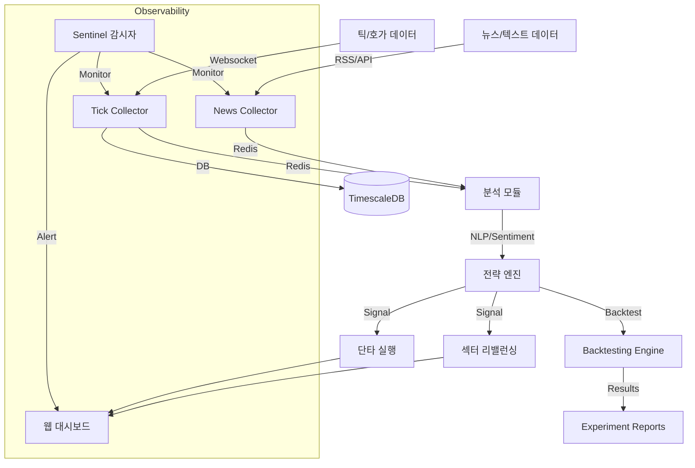

# 🦅 Antigravity Stock Monitoring System

> **"Data-First, Zero-Cost, High-Performance Investing Framework"**

본 프로젝트는 오라클 클라우드 프리티어 환경에서 동작하는 상용 수준의 주식/가상자산 모니터링 및 전략 시스템입니다. **Google Deepmind Antigravity** AI 에이전트와 함께 100% 설계 및 개발되었습니다.

---

## 🏛️ 프로젝트 철학 (`.ai-rules.md`)

이 프로젝트는 단순한 코딩을 넘어, 4명의 AI 페르소나가 상호 검증하며 개발합니다.
- **Zero Cost**: 모든 인프라와 외부 API는 무료 티어를 우선 사용합니다.
- **Smart Storage**: TimescaleDB의 압축 및 Continuous Aggregation을 활용하여 저장 공간을 최적화합니다.
- **High Performance**: 비동기(Async) 처리와 뱌치 인서트(Batch Insert)로 틱 단위 데이터를 유실 없이 처리합니다.
- **Observability**: **Sentinel** 감시자가 24시간 데이터의 정합성과 시스템 상태를 체크합니다.
- **Living Governance**: 모든 거버넌스 원칙은 실행 가능한 워크플로우(`@/command`)와 직접 바인딩되어 있습니다.

## 🏗️ 아키텍처 (Architecture)



## 📡 현재 시스템 상태 (Current Status)
- **Data Ingestion**: KR/US 실시간 틱 수집 및 뉴스(RSS) 수집 가동 중 (`src/data_ingestion`).
  - 🆕 **Kiwoom Integration**: WebSocket(100 slots) + REST(Index) 하이브리드 아키텍처 (2026-01-20)
  - **Coverage**: Top 40 (KIS) + Next 100 (Kiwoom) = **Total 140 Stocks**
- **Database**:
  - **TimescaleDB**: 실시간 틱 데이터 저장 (Hot/Warm).
  - **DuckDB**: 분석용 데이터 레이크 (Cold).
- **Monitoring**: **Sentinel**이 24시간 자원 및 데이터 흐름 감시 (Dead Man's Switch + Real-time Alerts).
- **Dashboard**: React 기반 웹 대시보드 (`port: 5173`) 및 FastAPI 백엔드 가동 중.
- **Migration**: **Zero-Cost Migration System** (Bash+SQL) 도입 완료 (`scripts/db/migrate.sh`).
- **Mock Data Mode**: 현재 UI는 시각적 검증을 위해 `Mock Data`로 구동 중입니다. (Backend 연동은 [BACKLOG.md](BACKLOG.md) 참조)

### 🆕 ISSUE-037: Unified API Hub v2 (REST Gateway) 🎯

**Status**: Phase 1 ✅ Complete | Phase 2 📝 In Design  
**Council Review**: ✅ Approved (Conditional) | **Tests**: 33/33 Pass (29 Unit + 4 Integration)

여러 증권사 REST API를 통합하여 단일 인터페이스로 제공하는 Gateway 시스템입니다.

#### ✅ Phase 1 완료 (Mock Mode - Production Ready)
- ✅ **RestApiWorker**: Redis 큐 기반 태스크 처리 워커 (`src/api_gateway/hub/worker.py`)
- ✅ **MockClient**: 실제 API 호출 없이 안전하게 테스트 가능한 Mock 클라이언트
- ✅ **QueueManager**: 우선순위 큐 처리 (`PRIORITY_QUEUE` > `NORMAL_QUEUE`)
- ✅ **TaskDispatcher**: Provider별 라우팅 + Circuit Breaker + Rate Limiter
- ✅ **Ground Truth Models**: CandleModel, TickModel (RFC-009 준수)
- ✅ **Docker Integration**: `gateway-worker-mock` 서비스 (Redis DB 15, 512M 메모리)
- ✅ **Test Coverage**: 33/33 통과 (29 unit + 4 integration)
- ✅ **Docker Validation**: 메모리 25MB/512MB, CPU 0.07%

#### 📝 Phase 2 설계 완료 (Real API Integration)
**Prerequisites Complete** (5/5):
- ✅ [BaseAPIClient 설계](docs/specs/api_hub_base_client_spec.md) - Abstract Base Class 패턴 (300+ lines)
- ✅ [API Fixtures](tests/fixtures/api_responses/) - KIS + Kiwoom 샘플 응답
- ✅ [Token Manager 설계](docs/specs/token_manager_spec.md) - Redis SSoT, Auto-refresh (200+ lines)
- ✅ [Rate Limiter 통합 계획](docs/specs/rate_limiter_integration_plan.md) - Gatekeeper 패턴
- ✅ [Phase 2 테스트 전략](docs/specs/phase2_test_plan.md) - Mock-only, CI-safe

**Next Steps**:
- ⏳ `BaseAPIClient`, `KISClient`, `KiwoomClient` 구현
- ⏳ `TokenManager` 구현 (Redis SSoT)
- ⏳ `redis-gatekeeper` 통합
- ⏳ Fixture-based unit tests (90%+ coverage)

#### 🔍 확장성
- **신규 Provider 추가**: 기존 코드 수정 없이 새 Client 클래스만 작성 (Open/Closed Principle)
- **Plugin Architecture**: `dispatcher.register_client("LS", ls_client)` 방식
- **Provider별 격리**: Rate Limiter, Token Manager 자동 격리

#### 실행 방법
```bash
# Mock 워커 시작 (Phase 1)
docker-compose --profile hub-mock up gateway-worker-mock

# 테스트 실행
PYTHONPATH=. poetry run pytest tests/unit/test_api_hub_*.py -v  # Unit tests
PYTHONPATH=. poetry run pytest tests/integration/test_api_hub_v2_integration.py -v -m manual  # Integration
```

#### 📚 관련 문서
- **[API Hub v2 Overview](docs/specs/api_hub_v2_overview.md)** - 전체 개요 및 사용 가이드 ⭐
- **[Council Review Report](docs/reports/20260123_issue037_council_review.md)** - Phase 1 승인 및 Phase 2 조건
- **[Prerequisites Complete](docs/reports/20260123_issue037_prerequisites_complete.md)** - 5개 선행 작업 완료
- **[Test Registry](docs/operations/testing/test_registry.md)** - HUB-* 테스트 목록 (33개)

---

## 🧪 TDD 기반 무결성 보장

모든 기능 구현은 반드시 테스트가 선행되거나 동치되어야 합니다.
- **[Test Registry](docs/operations/testing/test_registry.md)**: 현재 시스템의 모든 테스트 케이스와 검증 상황 목록.

## 🛠️ 시작하기 (Getting Started)

### 요구 사항
- Docker & Docker Compose
- Python 3.12+ (uv 또는 venv 권장)

### 실행 방법
```bash
# 1. 환경 변수 설정
# Local (Mac): cp .env.local.example .env.local
# Production (Oracle Cloud): cp .env.prod.example .env.prod
cp .env.template .env

# 2. 서비스 실행 (Auto-detected by Makefile)
make up

# 3. 전체 테스트 실행 (검증)
make test
```

## 🤖 Dual AI Support (Gemini + Claude Code)

본 프로젝트는 **Gemini Antigravity**와 **Claude Code** 두 AI를 동시에 지원합니다.

### AI별 워크플로우 사용법

| AI | 실행 방식 | 예시 | 특징 |
|----|----------|------|------|
| **Gemini Antigravity** | 자연어 요청 | "새로운 ISSUE 만들어줘" | 유연한 해석, 문맥 이해 |
| **Claude Code** | Slash commands | `/create-issue` | 결정적 실행, 자동완성 |

### 사용 가능한 Slash Commands (11개)

```bash
/create-issue          # ISSUE 등록 및 브랜치 생성
/run-gap-analysis      # 코드-문서 정합성 검증 ⭐
/council-review        # 6인 페르소나 협의 ⭐
/create-rfc            # RFC 문서 생성 ⭐
/create-spec           # Spec 문서 작성 ⭐
/activate-deferred     # 이연 작업 활성화
/create-roadmap        # 로드맵 생성
/brainstorm            # 아이디어 인큐베이팅
/amend-constitution    # 헌법 개정
/hotfix                # 긴급 프로덕션 수정
/merge-to-develop      # 품질 게이트 병합
```

⭐ = Constitution에서 명시적으로 요구하는 워크플로우

### 워크플로우 동기화

- **SSoT (원본)**: `.agent/workflows/` (Git 추적)
- **Claude 실행**: `.claude/commands/` (심링크)
- **동기화 스크립트**: `./scripts/sync-workflows.sh`

새 워크플로우 추가 시:
```bash
# 1. .agent/workflows/에 워크플로우 작성
# 2. 동기화 스크립트 실행
./scripts/sync-workflows.sh
```

상세: [RFC-004: Dual AI Workflow Sync](docs/governance/decisions/RFC-004_dual_ai_workflow_sync.md)

---

## 📚 문서 허브 (Documentation Hub)

### 핵심 거버넌스 문서

| 문서 (Document) | 역할 (Role) | 타겟 (Target) |
| :--- | :--- | :--- |
| **[MASTER_BUILD_GUIDE](file:///home/ubuntu/.gemini/antigravity/brain/ee8eaf5b-a6b8-4374-ab9b-277a200222dc/MASTER_BUILD_GUIDE.kr.md)** | **구축 가이드 (How)** | 0부터 시스템을 다시 만들려는 엔지니어 |
| **[Master Roadmap](docs/strategies/master_roadmap.md)** | **전략 로드맵 (What/When)** | 프로젝트의 미래와 마일스톤을 확인하려는 PM |
| **[Governance Rules](docs/governance/personas.md)** | **운영 원칙 (People)** | 6인의 페르소나 및 의사결정 프로토콜 |
| **[Development Standard](docs/governance/development.md)** | **개발 표준 (Method)** | GitHub Flow, 멀티 디바이스, 테스트 정책 |
| **[Protocol Specs](docs/specs/backend_specification.md)** | **통신 명세 (Spec)** | **SSoT**: Backend, UI, Database 명세서 모음 |
| **[Infrastructure Policy](docs/governance/infrastructure.md)** | **인프라 정책 (Tech)** | DB 격리, 보안(Tailscale), 리소스 제한 |

---

### 🚨 운영 문서 (Operations) - 장애 대응

**데이터가 수집되지 않나요?**
- 📘 [Runbook: Data Collection Recovery](docs/runbooks/data_collection_recovery.md)
  - Quick Diagnosis (SQL 명령어 포함)
  - Recovery Steps (Collector/Archiver별)
  - Verification Checklist

**알려진 이슈 확인**:
- 📋 [Known Issues](docs/KNOWN_ISSUES.md)
  - 최근 해결: Map-First Layout E2E 클릭 안정성 확보 (2026-01-15)
  - 최근 해결: ALREADY_IN_SUBSCRIBE 에러 (2026-01-15)
  - 최근 해결: Archiver restart policy 누락 (2026-01-15)

**장애 발생 시 보고**:
- 📊 [Incident Reports](docs/incidents/)
  - 최신: [2026-01-15 Data Collection Failures](docs/incidents/2026-01-15_data_collection_failures.md)

---

### 🚀 배포 문서 (Deployment)

**배포 전 필수 체크리스트**:
- ✅ [Deployment Checklist](docs/deployment/CHECKLIST.md)
  - Pre-deployment: 코드 리뷰, 테스트, 롤백 계획
  - **Critical**: Post-deployment 검증 (서비스 상태, 데이터 흐름, 5분 안정성 체크)

**모니터링 구현 가이드**:
- 📈 [Monitoring Requirements](docs/infrastructure/monitoring_requirements.md)
  - Prometheus 메트릭 정의
  - Alertmanager 알림 규칙
  - Grafana 대시보드 설계

---

### 📖 빠른 참조 (Quick Reference)

| 상황 | 문서 |
|------|------
| 🔴 프로덕션 장애 | [Data Collection Runbook](docs/runbooks/data_collection_recovery.md) |
| 🚀 코드 배포 | [Deployment Checklist](docs/deployment/CHECKLIST.md) |
| 📊 모니터링 구현 | [Monitoring Requirements](docs/infrastructure/monitoring_requirements.md) |
| 🐛 버그 확인 | [Known Issues](docs/KNOWN_ISSUES.md) |
| 🏛️ 아키텍처 이해 | [UI Design Master](docs/ui_design_master.md) |
| 👥 의사결정 방식 | [Personas & Council](docs/governance/personas.md) |

## 📡 현재 시스템 상태 (As of 2026-01-23)
- **Phase 1-5: Infrastructure, Pipeline, Monitoring, Optimization, Safety** ✅ [Completed]
- **Phase 6: Verification** ✅ [Completed] (E2E Test & Data Rescue)
- **Phase 7: Strategy & Experimentation** ✅ [Completed] (Isolated Backtest Infrastructure)
- **Phase 8: Intelligence** 🚧 [In Progress] (SDLC Automation & Gap Analysis Enhancements)
- **🆕 Unified Backlog Management**: `BACKLOG.md` SSoT 체계 구축 및 거버넌스(v2.18) 개정 완료.
- **🆕 Kiwoom Integration**: WebSocket + REST 하이브리드 수집 환경 구축 완료.
- **🆕 Zero-Tolerance Guard**: 장 초반 데이터 유실 방지 로직 구현 중 (`ISSUE-035`).
