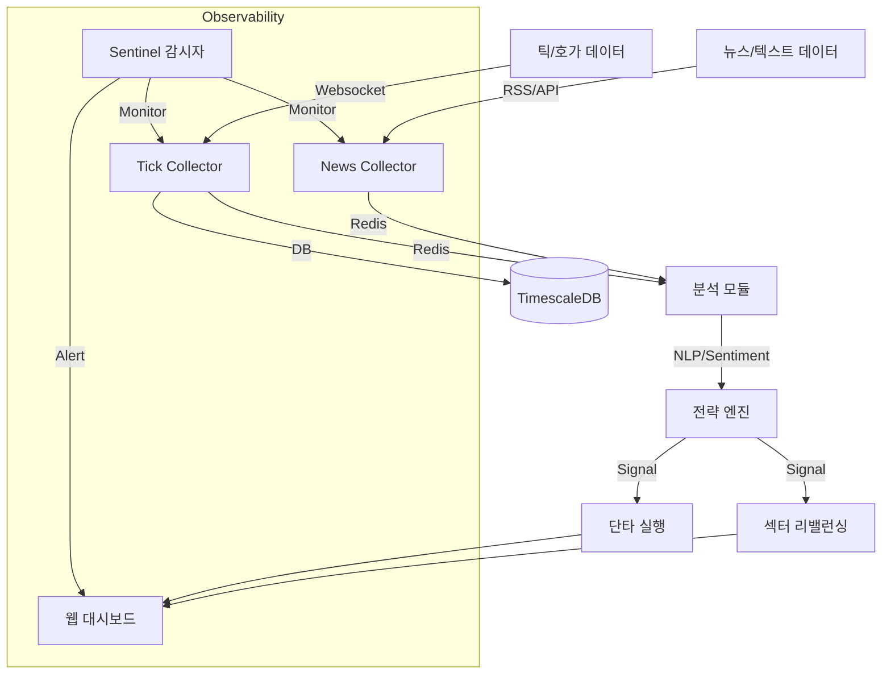

# 🦅 Antigravity Stock Monitoring System

> **"Data-First, Zero-Cost, High-Performance Investing Framework"**

본 프로젝트는 오라클 클라우드 프리티어 환경에서 동작하는 상용 수준의 주식/가상자산 모니터링 및 전략 시스템입니다. **Google Deepmind Antigravity** AI 에이전트와 함께 100% 설계 및 개발되었습니다.

---

## 🏛️ 프로젝트 철학 (`.ai-rules.md`)

이 프로젝트는 단순한 코딩을 넘어, 4명의 AI 페르소나가 상호 검증하며 개발합니다.
- **Zero Cost**: 모든 인프라와 외부 API는 무료 티어를 우선 사용합니다.
- **Smart Storage**: TimescaleDB의 압축 및 Continuous Aggregation을 활용하여 저장 공간을 최적화합니다.
- **High Performance**: 비동기(Async) 처리와 뱌치 인서트(Batch Insert)로 틱 단위 데이터를 유실 없이 처리합니다.
- **Observability**: **Sentinel** 감시자가 24시간 데이터의 정합성과 시스템 상태를 체크합니다.

## 🏗️ 아키텍처 (Architecture)



## 📡 현재 시스템 상태 (Current Status)
- **Data Ingestion**: KR/US 실시간 틱 수집 및 뉴스(RSS) 수집 가동 중 (`src/data_ingestion`).
  - 🆕 **구독 확인 로직**: 서버 응답(SUCCESS/FAILED) 파싱 및 재시도 (2026-01-14)
- **Database**:
  - **TimescaleDB**: 실시간 틱 데이터 저장 (Hot/Warm).
  - **DuckDB**: 분석용 데이터 레이크 (Cold).
- **Monitoring**: **Sentinel**이 24시간 자원 및 데이터 흐름 감시 (Dead Man's Switch).
- **Dashboard**: React 기반 웹 대시보드 (`port: 5173`) 및 FastAPI 백엔드 가동 중.

## 🧪 TDD 기반 무결성 보장

모든 기능 구현은 반드시 테스트가 선행되거나 동치되어야 합니다.
- **[Test Registry](docs/testing/test_registry.md)**: 현재 시스템의 모든 테스트 케이스와 검증 상황 목록.

## 🛠️ 시작하기 (Getting Started)

### 요구 사항
- Docker & Docker Compose
- Python 3.12+ (uv 또는 venv 권장)

### 실행 방법
```bash
# 1. 환경 변수 설정
cp .env.example .env

# 2. 서비스 실행 (Real-time Profile)
docker compose -f deploy/docker-compose.yml --profile real up -d --build

# 3. 전체 테스트 실행 (검증)
make test
```

## 📚 문서 허브 (Documentation Hub)

이 프로젝트는 3대 핵심 문서로 관리됩니다.

| 문서 (Document) | 역할 (Role) | 타겟 (Target) |
| :--- | :--- | :--- |
| **[MASTER_BUILD_GUIDE](file:///home/ubuntu/.gemini/antigravity/brain/ee8eaf5b-a6b8-4374-ab9b-277a200222dc/MASTER_BUILD_GUIDE.kr.md)** | **구축 가이드 (How)** | 0부터 시스템을 다시 만들려는 엔지니어 |
| **[Master Roadmap](docs/strategies/master_roadmap.md)** | **전략 로드맵 (What/When)** | 프로젝트의 미래와 마일스톤을 확인하려는 PM |
| **[Governance Rules](docs/governance/personas.md)** | **운영 원칙 (People)** | 6인의 페르소나 및 의사결정 프로토콜 |
| **[Development Standard](docs/governance/development.md)** | **개발 표준 (Method)** | GitHub Flow, 멀티 디바이스, 테스트 정책 |
| **[Infrastructure Policy](docs/governance/infrastructure.md)** | **인프라 정책 (Tech)** | DB 격리, 보안(Tailscale), 리소스 제한 |

## 📡 현재 시스템 상태 (As of 2026-01-14)
- **Phase 1: Infrastructure** ✅ [Completed]
- **Phase 2: Data Pipeline** ✅ [Completed] (Tick/News/Orderbook)
- **Phase 3: Monitoring** ✅ [Completed] (Sentinel Deadman's Switch)
- **Phase 4: Optimization** ✅ [Completed] (TimescaleDB Hypertable)
- **Phase 5: Safety** ✅ [Completed] (Environment Separation)
- **Phase 6: Verification** ✅ [Completed] (E2E Test & Data Rescue)
- **Phase 7: Intelligence** 🚧 [Planned] (SLM Log Analysis)
