# 🦅 Antigravity Stock Monitoring System

> **"Data-First, Zero-Cost, High-Performance Investing Framework"**

본 프로젝트는 오라클 클라우드 프리티어 환경에서 동작하는 상용 수준의 주식/가상자산 모니터링 및 전략 시스템입니다. **Google Deepmind Antigravity** AI 에이전트와 함께 100% 설계 및 개발되었습니다.

---

## 🏛️ 프로젝트 철학 (`.ai-rules.md`)

이 프로젝트는 단순한 코딩을 넘어, 4명의 AI 페르소나가 상호 검증하며 개발합니다.
- **Zero Cost**: 모든 인프라와 외부 API는 무료 티어를 우선 사용합니다.
- **Smart Storage**: TimescaleDB의 압축 및 Continuous Aggregation을 활용하여 저장 공간을 최적화합니다.
- **High Performance**: 비동기(Async) 처리와 뱌치 인서트(Batch Insert)로 틱 단위 데이터를 유실 없이 처리합니다.
- **Observability**: **Sentinel** 감시자가 24시간 데이터의 정합성과 시스템 상태를 체크합니다.

## 🏗️ 아키텍처 (Architecture)

```mermaid
graph TD
    News[뉴스/텍스트 데이터] -->|RSS/API| NewsCol[News Collector]
    NewsCol -->|Redis| Analysis[분석 모듈]
    Tick[틱/호가 데이터] -->|Websocket| TickCol[Tick Collector]
    TickCol -->|Redis| Analysis
    TickCol -->|DB| TimescaleDB[(TimescaleDB)]
    
    Analysis -->|NLP/Sentiment| Strategy[전략 엔진]
    Strategy -->|Signal| Rebalance[섹터 리밸런싱]
    Strategy -->|Signal| Scalping[단타 실행]
    
    Rebalance --> Web[웹 대시보드]
    Scalping --> Web
    
    subgraph Observability
        Sentinel[Sentinel 감시자] -->|Monitor| TickCol
        Sentinel -->|Monitor| NewsCol
        Sentinel -->|Alert| Web
    end
```



## 📡 현재 시스템 상태 (Current Status)
- **Data Ingestion**: KR/US 실시간 틱 수집 및 뉴스(RSS) 수집 가동 중 (`src/data_ingestion`).
- **Database**: 
  - **TimescaleDB**: 실시간 틱 데이터 저장 (Hot/Warm).
  - **DuckDB**: 분석용 데이터 레이크 (Cold).
- **Monitoring**: **Sentinel**이 24시간 자원 및 데이터 흐름 감시 (Dead Man's Switch).
- **Dashboard**: React 기반 웹 대시보드 (`port: 5173`) 및 FastAPI 백엔드 가동 중.

## 🧪 TDD 기반 무결성 보장

모든 기능 구현은 반드시 테스트가 선행되거나 동치되어야 합니다.
- **[Test Registry](docs/testing/test_registry.md)**: 현재 시스템의 모든 테스트 케이스와 검증 상황 목록.

## 🛠️ 시작하기 (Getting Started)

### 요구 사항
- Docker & Docker Compose
- Python 3.12+ (uv 또는 venv 권장)

### 실행 방법
```bash
# 1. 환경 변수 설정
cp .env.example .env

# 2. 서비스 실행 (Real-time Profile)
docker compose -f deploy/docker-compose.yml --profile real up -d --build

# 3. 전체 테스트 실행 (검증)
make test
```

## 📚 주요 문서 바로가기
- [Master Roadmap](docs/strategies/master_roadmap.md)
- [UI Design Master Document](docs/ui_design_master.md) 🆕
- [Test Registry](docs/testing/test_registry.md)
- [AI 협업 규칙 (.ai-rules.md)](.ai-rules.md)
- [환경 분리 로드맵](docs/strategies/env_separation_roadmap.md)
