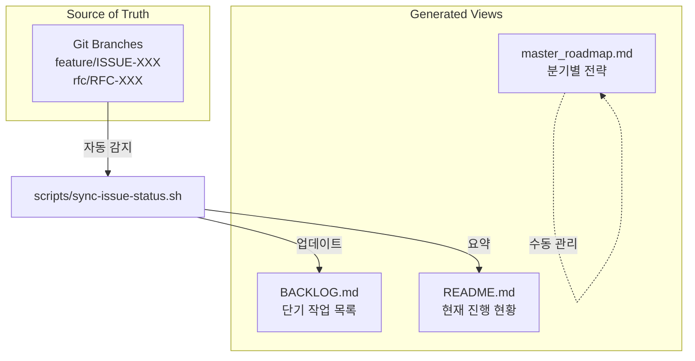

# IDEA: BACKLOG vs Roadmap 일원화 (Unified Task Management System)

**Status**: 🌿 Sprouting (Drafting)
**Priority**: P1 (High - Governance)
**Category**: Governance / Documentation

## 1. 개요 (Abstract)

현재 프로젝트에서 작업 상태를 관리하는 문서가 분산되어 있습니다:
- **BACKLOG.md**: 단기 작업 목록 (ISSUE/RFC)
- **master_roadmap.md**: 장기 전략 로드맵
- **task.md (Artifact)**: AI 세션별 작업 추적

**핵심 문제**: 
- 동일한 작업이 여러 문서에 중복 기록됨
- BACKLOG와 Roadmap의 경계가 모호함 (어디에 무엇을 쓸지 불명확)
- Git 브랜치 상태와 문서 상태가 불일치할 수 있음

## 2. 가설 및 기대 효과 (Hypothesis & Impact)

**가설**:
- **Single Source of Truth (SSoT)** 원칙을 적용하면, 작업 상태 관리가 명확해지고 중복이 제거됩니다.
- Git 브랜치를 **실질적 진행 상태의 원천**으로 삼고, 문서는 이를 **표현**하는 View로만 사용하면 동기화 문제가 해결됩니다.

**기대 효과**:
1. **명확성**: 어디를 보면 현재 진행 상황을 알 수 있는지 명확
2. **자동화**: Git 기반 → 수동 문서 업데이트 불필요
3. **일관성**: BACKLOG-Roadmap-Branch 3자 정합성 보장

## 3. 구체화 세션 (Elaboration - 6인 페르소나)

### Developer
"제 생각엔 Git 브랜치가 가장 정직한 '진행 상태'입니다. 문서는 브랜치를 읽어서 자동 생성하는 게 맞아 보여요. 지금처럼 수동으로 `[/]`를 체크하는 건 실수하기 쉽습니다."

### Governance Officer
"**3-Tier 구조**를 제안합니다:
1. **Roadmap** (전략): Q1/Q2/Q3 목표, Pillar 단위 (분기별 갱신)
2. **BACKLOG** (전술): 이번 달 할 일, RFC/ISSUE 단위 (주간 갱신)
3. **Git Branches** (실행): 지금 당장 코딩 중인 것 (실시간)

각각의 역할이 명확하면 중복이 아닙니다."

### Architect
"Roadmap은 '왜(Why)'와 '언제(When)'를 담고, BACKLOG는 '무엇(What)'을 담고, Branches는 '누가 지금(Who/Now)'을 담아야 합니다. 역할 분리가 중요합니다."

### Product Manager
"사용자 입장에서는 **한 곳만 보고 싶습니다**. 제안: `README.md`에 **Dashboard 섹션**을 만들어서, 스크립트로 현재 진행 중인 작업 TOP 5를 자동 표시하는 건 어떨까요?"

### Data Scientist
"데이터 파이프라인처럼 생각하면:
`Git Branches (Source)` → `scripts/sync-issue-status.sh (ETL)` → `BACKLOG.md (Warehouse)` → `README.md (Dashboard)`
이게 맞는 흐름입니다."

### QA Engineer
"검증 관점에서, **브랜치가 있는데 BACKLOG가 [ ]인 경우** 또는 **BACKLOG가 [/]인데 브랜치가 없는 경우**를 CI에서 에러로 잡아야 합니다. 정합성 검증이 필요합니다."

## 4. 제안하는 통합 구조 (Proposed Unified Structure)

### 역할 재정의

| 문서 | 역할 | 갱신 주기 | 소스 |
|------|------|-----------|------|
| **Git Branches** | 실행 중인 작업 (SSoT) | 실시간 | 개발자 작업 |
| **BACKLOG.md** | 단기 작업 목록 (1-2주) | 자동 (스크립트) | Git 브랜치 스캔 |
| **master_roadmap.md** | 장기 전략 (분기별) | 수동 (Council 승인) | RFC 승인 후 |
| **README.md** | 프로젝트 현황 요약 | 자동 (스크립트) | BACKLOG 요약 |

## 5. 구현 액션 아이템 (Action Items)

1. **즉시 (이번 세션)**:
   - `scripts/sync-issue-status.sh` 완성 (진행 중 ✓)
   - BACKLOG에 브랜치 정보 자동 표시

2. **단기 (이번 주)**:
   - `README.md`에 "📊 Current Status" 섹션 추가
   - CI에 정합성 검증 추가 (`.github/workflows/verify-backlog.yml`)

3. **중기 (다음 주)**:
   - `master_roadmap.md` 역할 재정의 (분기별 Pillar만)
   - BACKLOG은 자동 생성 파일로 전환 고려

## 6. 로드맵 연동 시나리오

이 아이디어가 승인되면:
- **Roadmap**: 전략적 방향만 (Q1: Virtual Investment, Q2: ML Signals)
- **BACKLOG**: 전술적 작업만 (자동 생성 또는 반자동)
- **Git**: 실행의 증거 (브랜치 = 진행 중)

**참고 사례**:
- **Kubernetes**: KEP (제안) → Tracking Issue (목록) → PR (브랜치)
- **Linux Kernel**: Roadmap (연간) → Mailing List (작업) → Git Tree (실행)
