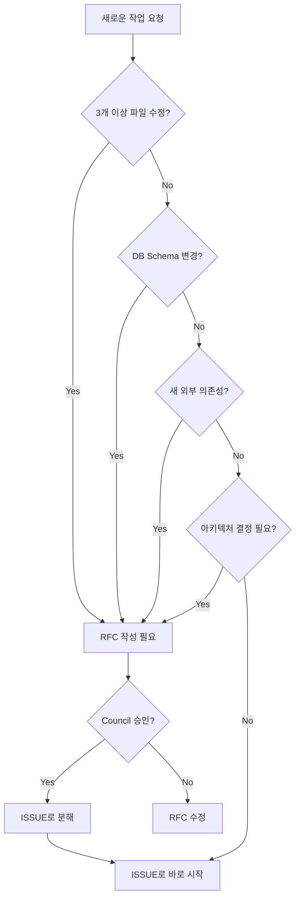

# IDEA: RFC와 ISSUE의 명확한 분리 정책 (RFC vs ISSUE Separation Policy)

**Status**: 🌿 Sprouting (Drafting)
**Priority**: P0 (Critical - Governance)
**Category**: Governance / Documentation

## 1. 개요 (Abstract)
현재 프로젝트에서 **RFC (설계 제안서)**와 **ISSUE (작업 추적)**이 혼용되어 혼란이 발생하고 있습니다.

**핵심 문제**:
- `ISSUE-001: Virtual Investment Platform`은 사실상 대규모 설계가 필요한 **RFC**여야 합니다.
- 일부 ISSUE는 단순 구현 작업이지만, 일부는 아키텍처 결정이 선행되어야 합니다.
- 현재 규칙에는 "언제 RFC를 쓰고, 언제 ISSUE로 바로 시작하는가?"에 대한 명확한 가이드라인이 없습니다.

## 2. 가설 및 기대 효과 (Hypothesis & Impact)

**가설**:
- RFC와 ISSUE를 명확히 구분하면, 불필요한 재작업과 설계 누락을 방지할 수 있습니다.
- "복잡도 기준"을 정의하여 자동으로 RFC 필요 여부를 판단할 수 있습니다.

**기대 효과**:
1. **설계 품질 향상**: 복잡한 기능은 RFC 단계에서 충분히 검토.
2. **작업 효율성**: 단순 작업은 ISSUE로 즉시 실행, 불필요한 문서 작업 방지.
3. **추적 가능성**: RFC → ISSUE 흐름이 명확해져 의사결정 히스토리 확보.

## 3. 구체화 세션 (Elaboration - 6인 페르소나)

### Developer
"저는 ISSUE를 받았을 때, '이게 왜 RFC 없이 바로 시작되었지?'라고 생각한 적이 여러 번 있습니다. 특히 Virtual Investment 같은 경우는 Adapter Pattern, DB Schema, 비용 계산 로직 등 여러 레이어에 걸친 설계가 필요한데, ISSUE로 등록되어 있어서 당황스러웠습니다."

### Governance Officer (거버넌스 담당자)
"**명확한 Decision Tree**가 필요합니다:
- 3개 이상의 컴포넌트/파일을 수정하는가? → RFC
- 새로운 외부 의존성을 추가하는가? → RFC  
- DB Schema 변경이 필요한가? → RFC
- API 엔드포인트를 새로 만드는가? → 복잡도에 따라

이런 기준을 헌법에 명시하면, AI든 사람이든 즉시 판단할 수 있습니다."

### Architect
"RFC는 '왜 이렇게 설계했는가'를 설명하는 문서이고, ISSUE는 '무엇을 할 것인가'를 추적하는 티켓입니다. 
RFC가 승인되면 → 여러 개의 ISSUE로 분해되어야 합니다.
예: `RFC-005: Virtual Investment` → `ISSUE-013: VirtualBroker`, `ISSUE-014: CostCalculator` 등"

### Data Scientist
"제 관점에서는 '데이터 영향도'도 기준이 되어야 합니다. 새로운 데이터 소스를 추가하거나, 집계 로직을 변경하는 것은 RFC가 필요합니다."

### DevOps
"인프라 변경(DB 추가, 새 서비스 배포)은 무조건 RFC입니다. 롤백 계획과 모니터링 전략이 선행되어야 합니다."

### QA Engineer
"테스트 관점에서는, '통합 테스트가 필요한가?'도 좋은 기준입니다. Unit Test만으로 검증 가능하면 ISSUE, E2E나 통합 테스트가 필요하면 RFC부터 시작하는 것이 안전합니다."

## 4. 제안하는 Decision Tree (의사결정 흐름)



## 5. 제안하는 헌법 조항 (Constitution Amendment v2.8)

`.ai-rules.md`의 **Section 5 (Spec Verification Gate)**에 추가:

```markdown
1.5. **RFC vs ISSUE Separation**: 
다음 조건 중 **하나라도** 해당하면 ISSUE 대신 **RFC**를 먼저 작성해야 한다:
- 3개 이상의 파일/컴포넌트를 수정하는 경우
- DB Schema 변경이 필요한 경우
- 새로운 외부 의존성(라이브러리, API)을 추가하는 경우
- 아키텍처 패턴 결정이 필요한 경우 (예: Adapter, Strategy)
- 통합 테스트 또는 E2E 테스트가 필요한 경우

**RFC 승인 후** → 구현 작업을 ISSUE로 분해하여 추적한다.
```

## 6. 로드맵 연동 시나리오

이 정책이 확정되면:
1. **즉시 적용**: 현재 `ISSUE-001` (Virtual Investment)을 `RFC-005`로 전환.
2. **전체 ISSUE 감사**: `ISSUE-002`~`ISSUE-013` 중 RFC가 필요한 항목 재분류.
3. **워크플로우 업데이트**: `/create-issue` 워크플로우에 "RFC 필요 여부 체크" 단계 추가.

## 7. 참고 사례 (Reference)

- **Kubernetes**: KEP (Kubernetes Enhancement Proposal) → Implementation Issue
- **Python**: PEP (Python Enhancement Proposal) → 여러 개의 Issue/PR
- **Rust**: RFC → Tracking Issue → Multiple PRs
