# 3-환경 워크트리 운영 가이드 (Multi-Environment Worktree Operations Guide)

**Version**: 2.0
**Date**: 2026-01-21
**Owner**: PM & Researcher
**Related**: ISSUE-032

---

## 개요

이 문서는 **3개 격리 환경**(Local/Prod/Backtest)의 운영 방법을 정의합니다.

### 3-환경 구조 (ISSUE-032)

```
로컬 Mac:
/Users/{username}/workspace/
└── stock_monitoring/     ← 🟢 LOCAL 환경 (개발)
    └── .git/            ← Git 디렉토리

서버 Linux:
/home/ubuntu/workspace/
├── stock_monitoring/     ← 🔴 PROD 환경 (운영/개발)
│   └── .git/            ← Git 원본 디렉토리
└── stock_backtest/       ← 🟡 BACKTEST 환경 (실험)
    └── .git             ← 워크트리 심볼릭 링크
```

### 환경 자동 감지 (make identify)

각 환경은 **폴더명 + OS**로 자동 감지됩니다:
```bash
make identify
```

감지 로직:
- Mac (Darwin) → **LOCAL**
- Linux + `stock_monitoring` → **PROD**
- Linux + `stock_backtest` → **BACKTEST**

---

## 브랜치 전략

### 1️⃣ Base 브랜치: `feat/backtest-environment`

**역할**: 백테스팅 인프라 코드 유지
- Docker Compose 설정
- 백테스터 엔진 코어
- 전략 베이스 클래스
- 설정 파일 템플릿

**수명**: 영구 유지 (삭제 금지)

**업데이트 시점**: 인프라 개선 필요 시에만
```bash
cd /home/ubuntu/workspace/stock_backtest
git checkout feat/backtest-environment
# 인프라 코드 수정...
git add .
git commit -m "feat(backtest): improve backtesting engine performance"
git push origin feat/backtest-environment
```

---

### 2️⃣ 실험 브랜치: `exp/{strategy-name}`

**역할**: 개별 전략 테스트
- 특정 전략 구현 코드
- 전략 파라미터 설정
- 임시 분석 스크립트

**수명**: 실험 종료 후 즉시 삭제

**생성 기준**: `develop` 브랜치에서 분기
```bash
cd /home/ubuntu/workspace/stock_backtest
git checkout develop
git pull origin develop
git checkout -b exp/momentum-strategy
```

**실험 진행 워크플로우**:
```bash
# 1. 실험 브랜치 생성
git checkout -b exp/momentum-strategy develop

# 2. 전략 코드 작성
vim src/backtest/strategies/momentum.py
vim configs/momentum_config.yaml

# 3. 백테스트 실행
make backtest-up
make backtest-shell
# python -m src.backtest.engine --config configs/momentum_config.yaml

# 4. 결과 분석 및 리포트 작성
vim docs/reports/experiments/20260114_momentum.md

# 5. 결과 리포트를 원본 저장소에 커밋
cd /home/ubuntu/workspace/stock_monitoring
git checkout develop
cp ../stock_backtest/docs/reports/experiments/20260114_momentum.md docs/reports/experiments/
git add docs/reports/experiments/20260114_momentum.md
git commit -m "docs: add momentum strategy backtest report"
git push origin develop

# 6. 실험 브랜치 삭제
cd /home/ubuntu/workspace/stock_backtest
git checkout develop
git branch -D exp/momentum-strategy
```

---

## 브랜치 라이프사이클

```mermaid
graph TD
    A[develop<br/>원본 저장소] --> B[feat/backtest-environment<br/>Base 브랜치<br/>영구 유지]
    B --> C[exp/momentum-strategy<br/>실험 1]
    B --> D[exp/mean-reversion<br/>실험 2]
    B --> E[exp/ml-lstm<br/>실험 3]
    
    C -->|실험 완료| F[리포트 작성]
    D -->|실험 완료| F
    E -->|실험 완료| F
    
    F --> G[원본 저장소에<br/>리포트 커밋]
    G --> H[브랜치 삭제]
    
    style B fill:#4CAF50,color:#fff
    style C fill:#FF9800,color:#fff
    style D fill:#FF9800,color:#fff
    style E fill:#FF9800,color:#fff
    style H fill:#f44336,color:#fff
```



---

## 실험 결과 보존 원칙

> [!IMPORTANT]
> **Grand Strategy 5.2: 지식의 자산화 (Knowledge Assetization)**
> 
> "브랜치는 삭제하더라도, 리포트는 남긴다."

### 실험 결과 리포트 작성 (필수)

**위치**: `docs/reports/experiments/{YYYYMMDD}_{strategy_name}.md`

**템플릿**:
```markdown
# [전략명] 백테스팅 결과

**실험 날짜**: 2026-01-14
**브랜치**: exp/momentum-strategy
**기간**: 2026-01-01 ~ 2026-01-14
**초기 자본**: 100,000,000 KRW

## 전략 개요
간단한 모멘텀 전략: 20일 평균 대비 2% 상승 시 매수

## 파라미터
- window: 20
- threshold: 0.02
- stop_loss: 0.05

## 성과 지표
- **총 수익률**: +5.2%
- **Sharpe Ratio**: 1.3
- **MDD**: -8.5%
- **Win Rate**: 52%
- **거래 횟수**: 45

## 주요 발견
- 변동성 큰 장에서 수익률 향상
- 손절 로직이 MDD 최소화에 기여
- ...

## 개선 방향
- 포지션 사이징 로직 개선 필요
- 거래 비용 반영 시 수익률 재평가
- ...

## 첨부
- 차트: [링크]
- 로그: [링크]
```

**책임**: **Data Scientist / Researcher**

---

## 격리 환경 관리 (ISSUE-032 완전 격리)

### 3-환경 완전 격리

각 환경은 **컨테이너명, 포트, DB, 볼륨**까지 완전히 분리됩니다.

| 항목 | 🟢 LOCAL (Mac) | 🔴 PROD (서버) | 🟡 BACKTEST (서버) |
|------|----------------|----------------|-------------------|
| **프로젝트명** | `stock_local` | `stock_prod` | `stock_backtest` |
| **Redis** | `stock_local-redis:6379` | `stock_prod-redis:6380` | `stock_backtest-redis:6381` |
| **TimescaleDB** | `stock_local-timescale:5432` | `stock_prod-timescale:5432` | `stock_backtest-timescale:5432` |
| **API Server** | `stock_local-api:8000` | `stock_prod-api:8001` | `stock_backtest-api:8002` |
| **Dashboard** | `stock_local-ui:5173` | `stock_prod-ui:5174` | `stock_backtest-ui:5175` |
| **DB Name** | `stockval_local` | `stockval` | `stockval_backtest` |
| **Env File** | `.env.local` | `.env.prod` | `.env.backtest` |
| **UI Badge** | 🟢 LOCAL | 🔴 PROD | 🟡 BACKTEST |

### UI 환경 배지

웹 대시보드 헤더에 현재 연결된 환경이 자동으로 표시됩니다:
- **LOCAL**: 초록색 배지 `🟢 LOCAL`
- **PROD**: 빨간색 배지 `🔴 PROD`
- **BACKTEST**: 노란색 배지 `🟡 BACKTEST`

이를 통해 **실수로 운영 환경에서 작업하는 것을 방지**할 수 있습니다.

### 환경 실행 명령

```bash
# 백테스팅 환경 시작
make backtest-up

# 백테스팅 환경 중지
make backtest-down

# 로그 확인
make backtest-logs

# 컨테이너 진입
make backtest-shell

# 데이터 및 볼륨 완전 삭제
make backtest-clean
```

### 동시 실행 가능

원본 환경과 백테스팅 환경은 **동시 실행 가능**합니다:
```bash
# Terminal 1: 원본 환경 (실시간 데이터 수집)
cd /home/ubuntu/workspace/stock_monitoring
make up

# Terminal 2: 백테스팅 환경 (과거 데이터 분석)
cd /home/ubuntu/workspace/stock_backtest
make backtest-up
```

---

## 🔍 워크트리 및 메인 저장소 식별 방법

현재 위치가 **백테스트 전용 워크트리**인지, 아니면 **메인 `develop` 저장소**인지 확인하는 방법입니다.

### 1. `git worktree list` 명령
```bash
git worktree list
# 결과 예시:
# /home/ubuntu/workspace/stock_monitoring  (main) [develop]
# /home/ubuntu/workspace/stock_backtest    (worktree) [feat/backtest-environment]
```

### 2. `.git` 항목의 성격 확인 (가장 확실함)
- **메인 저장소**: `.git`이 **디렉토리**입니다.
- **워크트리**: `.git`이 메인을 가리키는 **파일**입니다.

```bash
ls -ld .git
# 파일(-rw-...)로 나오면 "백테스트 워크트리" ✅
# 디렉토리(drw-...)로 나오면 "메인 저장소" ⚠️
```

### 3. 컨테이너 내부에서의 확인
백테스트 컨테이너는 오직 현재 워크트리의 코드만 마운트합니다. 컨테이너 내부에서 소스 코드를 수정해도 메인 저장소(`stock_monitoring`)의 실시간 수집기에는 전혀 영향을 주지 않습니다.

---

## 데이터 동기화 (Optional)

원본 환경의 실제 데이터를 백테스팅용으로 복사하려면:

```bash
# TimescaleDB 덤프 및 복원
cd /home/ubuntu/workspace/stock_monitoring
docker exec stock-timescale pg_dump -U postgres stockval | \
  docker exec -i backtest-timescale psql -U postgres backtest_db

# 또는 Tailscale 통해 프로덕션 데이터 복사
ssh stock-monitor-prod "docker exec stock-db pg_dump -U postgres stockval | gzip" | \
  gunzip | docker exec -i backtest-timescale psql -U postgres backtest_db
```

---

## Governance 준수 사항

### ✅ Auto-Proceed 원칙

백테스팅 코드 변경 시:
- **Safe 작업**: 단위 테스트 통과 시 즉시 진행
- **Unsafe 작업**: 인프라 변경 시 승인 필요

### ✅ Deep Verification

백테스트 결과 검증 시:
- **로그만 믿지 않기**: DB 직접 조회로 교차 검증
- 예: 거래 횟수가 로그와 DB에서 일치하는지 확인

### ✅ Reporting

실험 완료 후 반드시:
1. `docs/reports/experiments/` 에 리포트 작성
2. 원본 저장소에 커밋
3. 실험 브랜치 삭제

---

## FAQ

### Q1. 실험 브랜치를 develop에 머지할 수 있나요?
**A**: 아니요. 실험 브랜치는 **절대 머지하지 않습니다**. 리포트만 남기고 브랜치는 삭제합니다.

### Q2. 성공한 전략은 어떻게 운영에 반영하나요?
**A**: 
1. 실험 결과 리포트를 작성합니다.
2. 별도의 feature 브랜치를 생성합니다 (`feat/add-momentum-strategy`).
3. 전략 코드를 원본 저장소의 `src/strategies/`에 구현합니다.
4. PR을 통해 develop에 머지합니다.

### Q3. 백테스팅 인프라 개선은 어떻게 하나요?
**A**: `feat/backtest-environment` 브랜치에서 작업하고, PR을 통해 develop에 머지합니다.

### Q4. 여러 실험을 동시에 진행할 수 있나요?
**A**: 가능하지만 권장하지 않습니다. 워크트리는 하나의 브랜치만 checkout하므로, 동시 실험은 별도 워크트리 생성이 필요합니다.

---

## 참고 문서

- [Grand Strategy](../strategy/grand_strategy.md) - Phase 3: Strategy & Experimentation
- [Implementation Plan](file:///home/ubuntu/.gemini/antigravity/brain/f44ddd9b-ebce-450a-9269-8dc2a72e2d7a/implementation_plan.md) - 백테스팅 인프라 구축 계획
- [Development & Quality](../governance/development.md) - Git Flow 및 브랜치 전략
