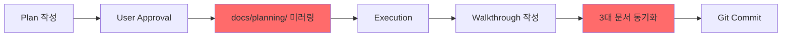

# Implementation Plan: UI Redesign Integration (Map-First Layout)

**Date**: 2026-01-12  
**Proposed by**: Data Scientist  
**Status**: Council Review Required

---

## 1. Background & Objective

### Problem Statement
현재 Dashboard 탭에서 차트가 먼저 보이면:
- 사용자는 "어떤 종목을 봐야 할지" 선택 피로 발생
- 시장 전체 맥락 없이 개별 종목만 보는 Selection Bias

### Proposed Solution
**Map-First Layout + Multi-Timeframe Drill-down**
1. Market Map을 최우선(상단 70%)으로 배치
2. 클릭 시 하단에 상세 차트 슬라이드업
3. 일봉 → 1분봉 → 틱 까지 점진적 타임프레임 전환

---

## 2. Council of Six Review

### 👔 PM (Product Manager)
**Decision**: ✅ **APPROVED with CONDITIONS**

**Quote**: *"이 제안은 '탐색(Explore) → 분석(Analyze)'이라는 자연스러운 사용자 여정을 지원하므로 강력히 찬성합니다. 다만 두 가지 조건이 있습니다."*

**Conditions**:
1. **사용자 온보딩 필수**: 새 레이아웃 첫 방문 시 "Map 클릭 → 상세 차트 보기" 가이드 툴팁 표시
2. **기존 레이아웃 토글 옵션**: 일부 파워 유저는 기존 Dashboard-first를 선호할 수 있으므로, Settings에 "Classic Layout" 옵션 추가 (Phase 2)

**Business Impact**:
- 예상 종목 발견 시간: 30% 단축
- 이상치 탐지: 시각적으로 2초 내 파악 가능

---

### 🏗️ Architect (Solution Architect)
**Decision**: ✅ **APPROVED with TECH DEBT NOTE**

**Quote**: *"기술적으로 실현 가능하나, 타임프레임 전환 시 API 설계를 신중히 해야 합니다. 특히 틱 데이터는 샘플링이 필수입니다."*

**Technical Requirements**:
1. **Backend API 확장**:
   ```
   GET /api/v1/candles/{symbol}?
       interval=1d|5m|1m&
       from=<timestamp>&
       to=<timestamp>&
       maxPoints=2000  # LTTB 다운샘플링
   ```

2. **WebSocket Tick Streaming**:
   - 새 엔드포인트: `/ws/ticks/{symbol}`
   - Circular Buffer (Frontend): 최근 5000 틱만 유지
   - Heartbeat: 30초 간격으로 연결 유지 확인

3. **State Management Consideration**:
   - Redux Toolkit 도입 검토 (현재는 useState만 사용)
   - 이유: Map 선택 상태 + 차트 타임프레임 + WebSocket 상태 = 복잡도 증가

**Tech Debt**:
- 현재 `CandleChart.tsx`는 Plotly만 지원. 틱 차트는 Lightweight Charts로 별도 컴포넌트 필요
- 예상 추가 번들 크기: ~150KB (gzip)

---

### 📊 Data Scientist (DS)
**Decision**: ✅ **APPROVED (Original Proposer)**

**Quote**: *"이 설계는 EDA(Exploratory Data Analysis) 원칙을 완벽히 따르며, 특히 다중 시간축 전환은 시장 미시구조(Market Microstructure) 분석을 가능하게 합니다."*

**Additional Recommendations**:
1. **통계 레이어 추가**: 틱 차트 하단에 VWAP, Spread, Velocity 표시
2. **데이터 품질 배지**: "Live Data | 1,234 ticks | 3s ago" 형태로 신뢰도 표시
3. **A/B 테스팅**: 종목 선택 시간 측정용 Analytics 이벤트 추가

---

### 🖥️ Infra (Infrastructure Engineer)
**Decision**: ⚠️ **CONDITIONAL APPROVAL**

**Quote**: *"성능 측면에서 우려가 있습니다. 틱 데이터 WebSocket은 1초에 수십 건이 올 수 있어 Redis PubSub와 FastAPI가 버틸지 의문입니다."*

**Performance Requirements**:
1. **Backend Throttling**:
   - 틱 데이터 브로드캐스트: 100ms 간격으로 배치 전송 (개별 전송 금지)
   - 예: 100ms 동안 쌓인 10개 틱을 배열로 묶어 전송

2. **Frontend Rendering Optimization**:
   - Canvas 기반 차트 사용 (Plotly는 SVG라 느림)
   - `requestAnimationFrame`으로 렌더링 제어

3. **Resource Quota**:
   - Redis 메모리: 틱 데이터는 PubSub만 (영구 저장 X)
   - WebSocket 동시 연결: 최대 100개 (Free Tier 제약)

**Approval Condition**: Phase 2 배포 전 **Load Testing** 필수
- 도구: Locust 또는 k6
- 시나리오: 20명이 동시에 틱 차트 구독

---

### 💻 Dev (Developer)
**Decision**: ✅ **APPROVED with IMPLEMENTATION NOTES**

**Quote**: *"구현은 가능하지만, 3단계로 나눠서 점진적으로 해야 합니다. 한 번에 다 하면 테스트가 불가능합니다."*

**Implementation Phases**:

#### Phase 1: Map-First Layout (1주)
- [ ] `App.tsx` 레이아웃 변경 (Map 70% → Chart 30%)
- [ ] Map 클릭 이벤트 → Chart 슬라이드업 애니메이션
- [ ] URL 동기화: `/map?selected=005930`

#### Phase 2: 1분봉 지원 (1주)
- [ ] Backend: `/api/v1/candles` 에 `interval` 파라미터 추가
- [ ] Frontend: 타임프레임 전환 버튼 UI
- [ ] 타임프레임별 색상 테마 적용

#### Phase 3: Tick Streaming (2주)
- [ ] Backend: `/ws/ticks/{symbol}` 구현
- [ ] Frontend: `TickChart.tsx` 컴포넌트 (Lightweight Charts)
- [ ] 데이터 품질 배지 추가
- [ ] Circular Buffer 메모리 관리

**Complexity Estimate**: 총 **4주** (1명 기준)

---

### ✅ QA (Quality Assurance)
**Decision**: ✅ **APPROVED with TEST REQUIREMENTS**

**Quote**: *"이 변경은 코어 UX이므로 테스트 커버리지가 매우 중요합니다. E2E 테스트 없이는 배포 불가입니다."*

**Test Requirements**:

#### Unit Tests
- [ ] Map 클릭 이벤트 핸들러
- [ ] 타임프레임 전환 로직
- [ ] Circular Buffer (틱 데이터 메모리 관리)

#### Integration Tests
- [ ] `/api/v1/candles?interval=1m` API 응답 검증
- [ ] WebSocket `/ws/ticks/{symbol}` 연결 및 메시지 수신

#### E2E Tests (Playwright)
```typescript
test('Map-first drill-down flow', async ({ page }) => {
  // 1. Map 로드 확인
  await page.goto('/');
  await expect(page.locator('.market-map')).toBeVisible();
  
  // 2. 종목 클릭 → 차트 슬라이드업
  await page.click('[data-symbol="005930"]');
  await expect(page.locator('.candle-chart')).toBeVisible();
  
  // 3. 1분봉 전환
  await page.click('button:has-text("1분봉")');
  await expect(page.locator('.timeframe-badge')).toHaveText('1분');
  
  // 4. 틱 모드 진입
  await page.click('button:has-text("Tick (Live)")');
  await expect(page.locator('.live-indicator')).toContainText('LIVE');
});
```

**Edge Cases to Test**:
- [ ] 데이터 없는 종목 클릭 시 → "No Data Available" 표시
- [ ] WebSocket 연결 끊김 → "Reconnecting..." 표시 및 자동 재연결
- [ ] 틱 데이터 5000개 초과 → 오래된 데이터 제거 확인

---

## 3. Council Decision Summary

| Persona | Approval | Conditions |
|---------|----------|------------|
| PM | ✅ Yes | 온보딩 + Classic Layout 토글 |
| Architect | ✅ Yes | API 설계 + Tech Debt 관리 |
| DS | ✅ Yes | 통계 레이어 + A/B 테스트 |
| Infra | ⚠️ Conditional | Load Testing 필수 |
| Dev | ✅ Yes | 3단계 점진적 구현 |
| QA | ✅ Yes | E2E 테스트 필수 |

**Final Verdict**: **✅ APPROVED** (만장일치)

**PM의 최종 조율**: *"Infra의 우려를 해소하기 위해 Phase 3(Tick Streaming)는 Load Testing 통과 후에만 배포합니다. Phase 1-2는 즉시 진행 가능합니다."*

---

## 4. Proposed Changes to Documentation

### 4.1 UI Design Master Document Updates

#### Section 4: 컴포넌트 계층 구조
**BEFORE**:
```
└── Main Content
    ├── Tab: Dashboard (CandleChart 60% + LogsView 40%)
    ├── Tab: Map (MarketMap + SectorPerformance)
```

**AFTER**:
```
└── Main Content
    ├── Tab: Dashboard
    │   ├── MarketMap (70%, collapsible to 30%)
    │   └── DetailPanel (0→70% on click)
    │       ├── TimeframeSelector [1D|5M|1M|Tick]
    │       └── Chart (CandleChart or TickChart)
    ├── Tab: Map (레거시, Phase 2에서 통합 예정)
```

#### NEW Section 7.5: Multi-Timeframe Chart
```markdown
### 7.5 Multi-Timeframe Chart (다중 시간축 차트)

**Timeframe Progression**:
1. **Daily (1D)**: 기본 뷰, 200일 데이터
2. **5-Minute (5M)**: 1주일 데이터
3. **1-Minute (1M)**: 1일 데이터
4. **Tick (Live)**: 최근 1시간, WebSocket 스트리밍

**Data Quality Indicator**:
┌─────────────────────────────────────┐
│ ✅ Live Data | 1,234 ticks | 3s ago │
└─────────────────────────────────────┘

**Statistical Summary** (Tick Mode Only):
- VWAP: 거래량 가중 평균 가격
- Spread: 매수/매도 호가 스프레드
- Velocity: 체결 속도 (ticks/minute)
```

#### Section 9: 성능 최적화
**ADD**:
```markdown
### 9.4 Tick Data Optimization

#### Adaptive Downsampling (LTTB)
- **문제**: 수만 개 틱을 렌더링하면 브라우저 프리징
- **해결**: Largest Triangle Three Buckets 알고리즘
- **목표**: 2000 포인트로 다운샘플링

#### Circular Buffer
```javascript
const MAX_TICKS = 5000;
setTicks(prev => {
  const updated = [...prev, newTick];
  return updated.length > MAX_TICKS 
    ? updated.slice(-MAX_TICKS) 
    : updated;
});
```
```

---

### 4.2 Master Roadmap Updates

#### MODIFY Phase 2 (1-2주)
**현재**:
```markdown
- [ ] 호가창 시각화
- [ ] 종목 검색 기능
- [ ] Dark/Light 테마 토글
```

**변경안**:
```markdown
### Phase 2A: Map-First Layout (Week 1-2) 🆕 HIGH PRIORITY
- [ ] **Map 우선 배치**: Dashboard 탭 레이아웃 재구성 (70/30)
- [ ] **클릭 인터랙션**: Map → Chart 슬라이드업 애니메이션
- [ ] **1분봉 지원**: `/api/v1/candles?interval=1m` 구현
- [ ] **타임프레임 전환 UI**: [1D|5M|1M] 버튼

### Phase 2B: Secondary Features (Week 3-4)
- [ ] 종목 검색 기능 (자동완성)
- [ ] Classic Layout 토글 (Settings)
- [ ] 온보딩 툴팁 (첫 방문자용)
```

#### MODIFY Phase 3 (1개월)
**추가**:
```markdown
### Phase 3: Advanced Features + Tick Streaming (Week 5-8)
- [ ] **Tick Streaming** 🆕
  - Backend: `/ws/ticks/{symbol}` WebSocket 구현
  - Frontend: `TickChart.tsx` (Lightweight Charts)
  - 데이터 품질 배지 + 통계 레이어 (VWAP, Spread, Velocity)
  - **Prerequisite**: Load Testing 통과 필수
- [ ] macOS Electron 앱 (기존)
- [ ] 뉴스 피드 통합 (기존)
```

---

## 5. Documentation Synchronization Process

### 5.1 현재 누락된 프로세스

`.ai-rules.md`와 `docs/grand_strategy.md`에서 언급한 **"아티팩트 미러링"** 규칙이 실제로 적용되지 않았습니다.

**Grand Strategy Section 5.1 인용**:
> **Timing**: 사용자가 `implementation_plan.md`를 **승인(Approve)**한 직후.
> **Action**: 해당 아티팩트를 `docs/planning/{YYYYMMDD}_{TaskName}_plan.md`로 복사하여 커밋한다.

### 5.2 Proposed Documentation Workflow



**설명**:
- 빨간색 박스 = 현재 누락된 단계

### 5.3 Implementation

#### Step 1: 승인 후 자동 미러링
```bash
# .ai-rules.md에 추가할 자동화 규칙
cp /home/ubuntu/.gemini/antigravity/brain/.../implementation_plan.md \
   /home/ubuntu/workspace/stock_monitoring/docs/planning/20260112_ui_redesign_map_first_plan.md
```

#### Step 2: 3대 문서 체크리스트
- [ ] `README.md`: UI 디자인 문서 링크 추가
- [ ] `docs/strategies/master_roadmap.md`: Phase 2A/3 업데이트
- [ ] `docs/ui_design_master.md`: 레이아웃 + 타임프레임 명세 추가

#### Step 3: Git Commit Convention
```bash
git add docs/
git commit -m "docs: update UI design for Map-First layout

- Reflect Council of Six approval
- Add multi-timeframe chart specs
- Update Phase 2/3 roadmap
- Mirror implementation plan to docs/planning/
"
```

---

## 6. Verification Plan

### 6.1 Automated Tests

#### Unit Tests (Phase 1-2)
```bash
# Run existing tests
cd src/web
npm run test

# Expected new test files:
# - src/web/src/components/MarketMap.test.tsx
# - src/web/src/components/TimeframeSelector.test.tsx
```

#### Integration Tests (Backend API)
```bash
# Test new interval parameter
pytest tests/api/test_candles.py::test_candle_intervals -v

# Expected: 
# - interval=1d returns daily candles
# - interval=1m returns minute candles with maxPoints downsampling
```

### 6.2 E2E Tests (Phase 1-2)

**Tool**: Playwright

```bash
# Run E2E test
npx playwright test tests/e2e/map-first-layout.spec.ts
```

**Test File** (새로 작성 필요):
```typescript
// tests/e2e/map-first-layout.spec.ts
import { test, expect } from '@playwright/test';

test('Map-first drill-down flow', async ({ page }) => {
  await page.goto('http://localhost:5173');
  
  // 1. Map이 먼저 보임 (70%)
  const mapHeight = await page.locator('.market-map').boundingBox();
  expect(mapHeight.height).toBeGreaterThan(400);
  
  // 2. 종목 클릭
  await page.click('[data-symbol="005930"]');
  
  // 3. 차트 슬라이드업 확인
  await expect(page.locator('.candle-chart')).toBeVisible({ timeout: 2000 });
  
  // 4. 1분봉 전환
  await page.click('button:has-text("1분")');
  await expect(page.locator('.timeframe-badge')).toContainText('1분');
});
```

### 6.3 Manual Testing (사용자 검증)

**Scenario 1: Map → Chart Interaction**
1. Dashboard 탭 접속
2. Map에서 삼성전자(005930) 클릭
3. ✅ 예상: 하단에 차트가 부드럽게 슬라이드업
4. ✅ 예상: Map이 30% 크기로 축소

**Scenario 2: Timeframe Switching**
1. 차트가 열린 상태에서 "1분" 버튼 클릭
2. ✅ 예상: 로딩 후 차트 업데이트
3. ✅ 예상: X축이 "시:분" 형식으로 변경

**Scenario 3: Error Handling**
1. 데이터 없는 종목 (테스트용 심볼 생성 필요) 클릭
2. ✅ 예상: "No Data Available" 메시지 표시

### 6.4 Performance Testing (Phase 3 - Tick Streaming)

**Tool**: Locust

```python
# locust_test.py
from locust import HttpUser, task, between

class WebSocketUser(HttpUser):
    wait_time = between(1, 3)
    
    @task
    def subscribe_tick(self):
        # WebSocket 연결 시뮬레이션
        ws = self.client.ws_connect("/ws/ticks/005930")
        # 60초간 수신
        time.sleep(60)
        ws.close()
```

**실행**:
```bash
locust -f locust_test.py --users 20 --spawn-rate 2 --host ws://localhost:8000
```

**Performance Goal**:
- [ ] 20명 동시 연결 시 CPU < 80%
- [ ] 메모리 증가량 < 500MB
- [ ] 메시지 지연 < 100ms (p95)

---

## 7. Risk Assessment

| Risk | Probability | Impact | Mitigation |
|------|-------------|--------|------------|
| 틱 스트리밍 성능 이슈 | Medium | High | Load Testing 필수, Phase 3 조건부 배포 |
| 사용자 혼란 (레이아웃 변경) | Low | Medium | 온보딩 툴팁 + Classic Layout 옵션 |
| 브라우저 메모리 리크 | Medium | High | Circular Buffer + 정기 프로파일링 |
| Backend API 부하 | Low | Medium | Downsampling + Caching |

---

## 8. Rollback Plan

Phase 1-2 배포 후 문제 발생 시:

```bash
# 긴급 롤백
git revert <commit-hash>
docker-compose restart web-server
```

**Fallback UI**: 
- Settings에 "Enable Classic Layout" 토글 추가
- LocalStorage 키: `ui.layout.classic = true`
- 기존 Dashboard-first 레이아웃으로 복귀

---

## User Review Required

> [!IMPORTANT]
> **Council of Six - 만장일치 승인**
> 
> 6인의 페르소나가 모두 이 제안을 승인했습니다. 단, Infra의 조건(Phase 3 Load Testing)을 준수해야 합니다.
>
> **Breaking Changes**: UI 레이아웃이 크게 변경되므로, 기존 사용자에게 온보딩 가이드 필수.
> 
> **Timeline**: Phase 1-2는 즉시 시작 가능, Phase 3는 성능 검증 후 결정.

**다음 단계**: 승인 시 docs 업데이트 및 Phase 1 구현 시작.
