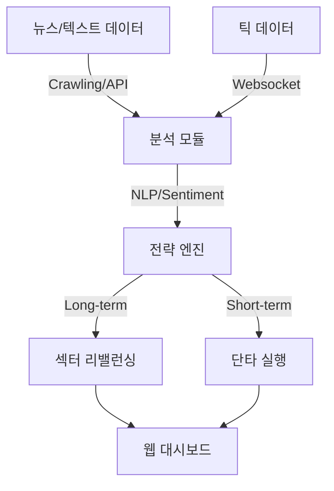

# 프로젝트 컨텍스트 (Anchor)

이 문서는 `stock_monitoring` 프로젝트의 **Source of Truth**입니다. 모든 에이전트는 작업을 시작하기 전에 이 문서를 참조해야 합니다.

## 1. 프로젝트 개요
**바이브코딩(Vibe Coding)**: 감각과 데이터에 기반한 주식 투자 전략 자동화 시스템.
> 본 프로젝트는 **Antigravity**를 사용하여 처음부터 끝까지 구축되는 **파일럿 프로젝트**입니다. 성공적인 운영 사례를 만드는 것을 목표로 합니다.

### 핵심 우선순위 (Core Priorities)
1.  **데이터 수집 우선 (Data First)**: 로직 구현보다 데이터 수집/적재 파이프라인의 안정성을 최우선으로 확보한다.
    -   *맥락*: 안정적인 데이터가 없으면 전략도 없다. 로직은 추후에 붙인다.
2.  **리소스 효율화**: 오라클 프리티어 한계 내에서 최적화.

### 목표
1.  **장기 전략 (Long-term)**:
    -   뉴스 및 소셜 미디어(텍스트)를 수집하여 호재/악재 판독.
    -   NLP(Natural Language Processing) 기반 섹터(Sector) 리밸런싱 전략 수립.
    -   인사이트 도출 및 웹 대시보드 호스팅.
2.  **단기 전략 (Short-term)**:
    -   틱(Tick) 데이터를 실시간 수집.
    -   단타(Scalping) 전략 수립.

## 2. 기술 스택 (Tech Stack)
-   **언어**: Python (주력), JavaScript (웹 프론트엔드 필요시)
-   **인프라**: Oracle Cloud Free Tier (ARM/AMD Instance)
    -   *제약 사항*: 메모리 및 CPU 리소스가 제한적이므로 경량화 필수.
-   **데이터 처리**: 
    -   **NLP**: 경량 LLM (API 활용) 또는 로컬 임베딩 모델 활용.
    -   **수집**: BeautifulSoup, Selenium (필요시), API (News, Twitter 등).
-   **컨테이너**: Docker, Docker Compose
-   **데이터베이스**: (추후 결정, 파일 기반 또는 경량 DB 고려)
-   **시크릿 관리**: `.env` 및 GitHub Secrets (오픈 레포지토리 전제)
-   **버전 관리**: Git

## 3. 아키텍처 개요

## 4. 운영 원칙
1.  **비용 효율성**: 오라클 프리티어 범위 내에서 운영. 무거운 모델은 로컬 또는 API 활용 고려.
2.  **보안**: 민감 정보(API Key 등)는 절대 코드에 하드코딩하지 않음.
3.  **문서화**: 모든 산출물은 한글로 작성하며, `docs/` 및 `task.md`를 최신화 유지.
