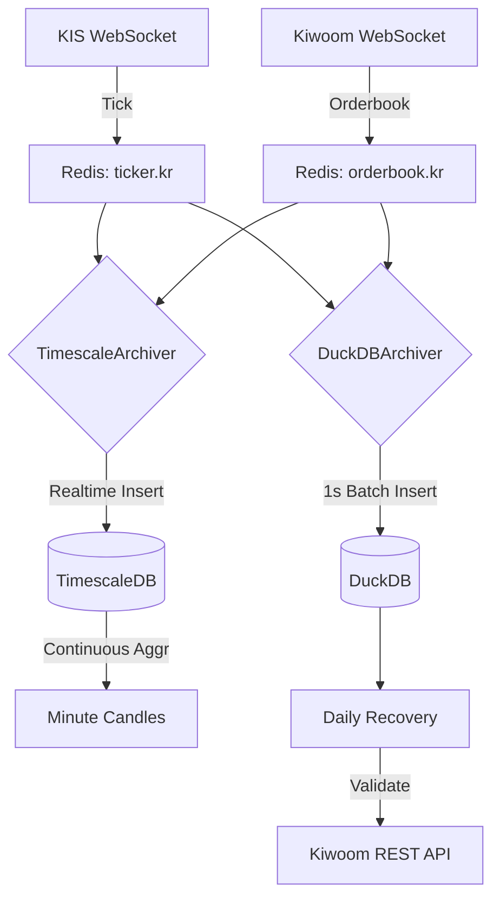

# RFC-008: Tick Data Completeness & Quality Assurance System

**Status**: 🟡 Proposed  
**Created**: 2026-01-19  
**Author**: Antigravity AI  
**Supersedes**: [ID-daily-minute-recovery-qa.md](file:///home/ubuntu/workspace/stock_monitoring/docs/ideas/stock_monitoring/ID-daily-minute-recovery-qa.md)  

---

## 1. Executive Summary

### Problem Statement
현재 KIS/Kiwoom WebSocket을 통한 실시간 틱 데이터 수집은 네트워크 장애, API 제한, 소켓 끊김 등으로 인한 **데이터 누락 위험**이 존재합니다. 백테스팅과 머신러닝 학습 데이터의 신뢰성을 위해서는 **100%에 가까운 틱 데이터 완전성**이 필수적입니다.

### Proposed Solution
3단계 품질 보증 시스템:
1. **[P0] 틱 수집 강화**: 중복 제거, 버퍼링, Gap 감지 및 복구 로깅
2. **[P1] 분봉 배치 생성**: 수집된 틱 데이터로부터 SQL 기반 분봉 집계
3. **[P2] API 교차 검증**: 틱 기반 분봉 vs KIS/Kiwoom REST 분봉 비교

### Success Criteria
- 틱 데이터 누락률 < 0.1%
- 중복 저장 = 0건
- 분봉 생성 정확도 > 99%

---

## 2. Motivation

### 2.1 Current State (As-Is)

```
[KIS WebSocket]
   ├─ Tick ──┐
   └─ Hoga ──┴─→ UnifiedCollector → Redis → TimescaleDB (Dual Write)
                   (메모리 부족 위험, KIS 부하 집중)
```

**문제점**:
1. **단일 소스 의존**: KIS 장애 시 틱/호가 모두 중단.
2. **KIS 소켓 부하**: KIS 소켓 하나로 틱/호가 모두 처리 시 Latency 증가 (Zero Cost 환경).
3. **DB 리소스**: TimescaleDB 단일 저장소는 분석용(Cold)으로 무겁고, DuckDB는 실시간용(Hot)으로 부족.

### 2.2 Desired State (To-Be: Hybrid & Multi-Vendor)

```
[KIS WebSocket] ────→ Tick ────┐
                               │
[Kiwoom WebSocket] ─→ Hoga ────┼─→ Redis ──┬─→ [TimescaleDB] (Hot/Realtime)
                               │           │    ├─ 실시간 차트 (1m/5m/1h)
                               │           │    └─ 시스템 메트릭
                               │           │
                               │           └─→ [DuckDB] (Cold/Analytics)
                               │                ├─ 틱/호가 전체 로그 (Batch)
                               │                └─ Daily Recovery & QA
```

**핵심 변경**:
1. **Vendor 이원화**: 틱(KIS) / 호가(Kiwoom) 분리하여 리스크 분산.
2. **DB Hybrid**: 실시간성(Timescale)과 분석/보관(DuckDB)의 강점 결합.
3. **Deep Integrity**: DuckDB를 'Ground Truth'로 하여 Daily Recovery 수행.

---

## 3. Technical Design

### 3.1 Component Overview

| Component | 역할 | Source | Storage | Priority |
|-----------|------|--------|---------|----------|
| **EnhancedTickCollector** | 틱 수집 및 발행 | **KIS** | Redis | P0 |
| **KiwoomOrderbookCollector** | 호가 수집 및 발행 | **Kiwoom** | Redis | P0 |
| **TimescaleArchiver** | 실시간 데이터 적재 | Redis | **TimescaleDB** | P1 |
| **DuckDBArchiver** | 대용량 배치 적재 | Redis | **DuckDB** | P1 |
| **DailyRecovery** | 품질 검증 및 복구 | REST API | DuckDB | P2 |

### 3.2 Data Flow



### 3.3 Database Strategy (Hybrid)

#### TimescaleDB (Hot Data)
- **목적**: 실시간 차트 스트리밍, 시스템 모니터링
- **보관 주기**: 최근 7일 (Retention Policy 적용)
- **Table**: `market_ticks`, `market_orderbook`, `system_metrics`
- **Feature**: Continuous Aggregates (1m, 5m, 1h 자동 생성)

#### DuckDB (Cold Data)
- **목적**: 전체 과거 데이터 보관, 백테스팅, ML 학습, 무결성 검증
- **보관 주기**: 영구 (Permanent)
- **Table**: `market_ticks`, `market_orderbook`, `minute_candles`
- **Feature**: 고속 OLAP 쿼리, Parquet Export

### 3.4 Kiwoom Orderbook Specification

- **TR ID**: `real_hoga` (주식호가)
- **Fields**: 매도호가1~10, 매수호가1~10, 매도잔량, 매수잔량
- **특징**: KIS보다 데이터 업데이트 빈도가 높을 수 있음 (Throttle 필요 가능성)


### 3.4 External API Specifications

#### Kiwoom Chart REST API

본 시스템은 틱 데이터 검증을 위해 키움증권의 차트 조회 API를 사용합니다.

**상세 스펙**: [Kiwoom Chart API Specification](file:///home/ubuntu/workspace/stock_monitoring/docs/specs/kiwoom-chart-api.md)

**핵심 활용**:
- **엔드포인트**: `POST /api/v1/daily/chart`
- **제공 데이터**: 1분봉 OHLCV + **틱 개수** (`trde_qty`)
- **검증 로직**: `틱 DB의 COUNT(*) == 키움 API의 trde_qty` → 완전성 보장

**검증 우선순위**:
1. **Primary**: Kiwoom API (안정적, 틱 개수 제공)
2. **Secondary**: KIS API (백업 용도)

### 3.5 Quality Metrics

#### A. Coverage (커버리지)

```
틱 커버리지 = (수집된 틱 수 / KIS REST 분봉 거래량 합계) × 100%

임계값:
- > 95%: ✅ Excellent
- 90-95%: ⚠️ Warning
- < 90%: ❌ Critical
```

#### B. Consistency (일관성)

```
분봉 일치율 = (OHLCV 일치 분봉 수 / 전체 분봉 수) × 100%

OHLCV 일치 조건:
- |tick_open - kis_open| / kis_open < 0.5%
- |tick_high - kis_high| / kis_high < 0.5%
- |tick_low - kis_low| / kis_low < 0.5%
- |tick_close - kis_close| / kis_close < 0.5%
- |tick_volume - kis_volume| / kis_volume < 5%
```

#### C. Latency (지연시간)

```
지연 = DB 저장 시각 - 체결 시각

목표:
- P99 < 100ms (틱 수집)
- P99 < 1000ms (분봉 생성 - 배치 처리)
```

---

## 4. Implementation Plan

### Phase 1: 틱 수집 강화 (Week 1)

**목표**: 틱 누락률 < 0.1%

- [ ] `EnhancedTickCollector` 구현
  - 체결번호 기반 중복 제거
  - 1초 배치 INSERT (5,000 rows/batch)
  - 10초+ Gap 시 Redis 알림 발송
- [ ] `TickRecoveryLogger` 구현
  - 소켓 끊김 이벤트 로깅
  - `recovery:pending` Redis Set에 저장
- [ ] Unit Tests
  - 중복 제거 테스트
  - Gap 감지 테스트
  - 버퍼 플러시 테스트

### Phase 2: 분봉 생성 (Week 2)

**목표**: 분봉 완성도 > 98%

- [ ] `generate_candles_from_ticks.py` 구현
  - DuckDB `time_bucket()` 함수 사용
  - 1분봉, 3분봉, 5분봉 지원
  - Upsert 로직 (`ON CONFLICT DO UPDATE`)
- [ ] DB 마이그레이션
  - `minute_candles` 테이블 생성
  - `execution_no` 컬럼 추가
- [ ] 검증
  - 과거 틱 데이터로 분봉 생성 테스트
  - 예상 분봉 수(391개/종목) 대비 생성률 확인

### Phase 3: API 교차 검증 (Week 3)

**목표**: 일치율 > 99%

- [ ] `cross_validate_candles.py` 구현
  - KIS REST API 분봉 수집
  - SQL JOIN 기반 비교 분석
  - 불일치 항목 CSV 리포트 생성
- [ ] Cron Job 설정
  ```bash
  # /etc/cron.d/tick-qa
  0 16 * * 1-5 /app/scripts/cross_validate_candles.py --date TODAY
  ```
- [ ] 알림 통합
  - Slack Webhook (Coverage < 95% 시)

### Phase 4: 프로덕션 배포 (Week 4)

- [ ] 모니터링 대시보드
  - Sentinel에 틱 커버리지 메트릭 추가
  - 일일 품질 점수 그래프
- [ ] 문서화
  - Walkthrough 작성
  - 운영 매뉴얼 업데이트
- [ ] 1주일 파일럿 운영

---

## 5. Council Review

### 👨‍💼 PM (Product Manager)
> **승인**: ✅  
> "데이터 품질이 백테스팅 신뢰도의 핵심입니다. P0 우선순위로 진행하세요."

### 🏗️ Architect
> **승인**: ✅  
> "분봉 생성을 틱 수집과 완전히 분리한 점이 탁월합니다. Celery는 나중에 도입해도 됩니다."

### 🔧 DevOps Lead
> **조건부 승인**: ⚠️  
> "DuckDB 쓰기 성능 벤치마크를 먼저 실행하세요. 버퍼링 효과를 수치로 입증해야 합니다."

### 🧪 QA Lead
> **승인**: ✅  
> "임계값(Coverage < 95% = FAIL)이 명확합니다. 리포트 자동화는 필수입니다."

### 🛡️ Security Lead
> **승인**: ✅  
> "분봉 데이터도 DuckDB 파일 암호화 대상입니다. 기존 정책 그대로 적용하세요."

### 💻 Engineer
> **승인**: ✅  
> "±1초 Fuzzy Matching으로 분봉-틱 매칭 문제 해결 가능합니다. 구현 난이도 낮습니다."

**Council 결정**: ✅ **만장일치 승인** (조건: DuckDB 벤치마크 선행 실행)

---

## 6. Risks & Mitigation

| Risk | Impact | Mitigation | Probability |
|------|--------|------------|-------------|
| **DuckDB 쓰기 병목** | 틱 누락 | 버퍼링 도입 (벤치마크 선행) | Medium |
| **체결번호 미제공** | 중복 제거 실패 | timestamp+price+volume 조합 사용 | Low |
| **KIS API Rate Limit** | 검증 지연 | Kiwoom API 대체 또는 익일 처리 | Low |
| **메모리 버퍼 손실** | 최대 1초치 데이터 손실 | Daily Recovery로 복구 (허용) | Low |

---

## 7. Success Metrics

### Quantitative

- [ ] 틱 커버리지 > 99%
- [ ] 중복 저장 = 0건
- [ ] 분봉 일치율 > 99%
- [ ] P99 지연 < 100ms

### Qualitative

- [ ] 일일 품질 리포트 자동 생성
- [ ] Council Review 통과
- [ ] 1주일 파일럿 운영 성공

---

## 8. Alternatives Considered

### Alternative 1: 실시간 분봉 집계 (In-Memory)

**장점**:
- 분봉 생성 지연 < 1ms
- 실시간 차트 제공 가능

**단점**:
- 틱 수집 성능 저하 (10-20%)
- 서버 재시작 시 미완성 분봉 손실
- 복잡도 증가

**결정**: ❌ **기각** (틱 수집이 최우선 목표)

### Alternative 2: Celery 비동기 작업 큐

**장점**:
- 스케줄링 관리 용이
- 실패 재시도 자동화

**단점**:
- 인프라 복잡도 증가 (RabbitMQ/Redis Queue)
- 오버엔지니어링 (현재 규모에 불필요)

**결정**: 🕐 **보류** (Phase 4 이후 검토)

---

## 9. Rollout Strategy

### Canary Deployment

```
Week 1: 1개 종목 (005930)
Week 2: 10개 종목 (KOSPI 대형주)
Week 3: 50개 종목
Week 4: 전체 100개 종목 (Full Deployment)
```

### Rollback Plan

버퍼링 로직 실패 시:
1. `EnhancedTickCollector` 비활성화
2. 기존 즉시 INSERT 방식으로 복귀
3. 틱 데이터는 보존됨 (분봉 생성만 지연)

---

## 10. Open Questions

1. **DuckDB 벤치마크 결과가 5,000 writes/sec를 감당하지 못하면?**
   - → PostgreSQL 또는 ClickHouse로 마이그레이션 고려
   - → 종목별 파일 분할 (`ticks_005930.duckdb`)

2. **체결번호가 제공되지 않는 API가 있다면?**
   - → `hash(symbol + timestamp + price + volume)` 사용
   - → 극히 드문 충돌만 허용 (< 0.01%)

3. **KIS와 Kiwoom 분봉이 모두 틱 집계와 불일치하면?**
   - → 틱 데이터를 Ground Truth로 간주
   - → 수동 검증 후 API 이슈로 보고

---

## 11. Approval

| Role | Name | Approval | Date |
|------|------|----------|------|
| PM | Council | ✅ Approved | 2026-01-19 |
| Architect | Council | ✅ Approved | 2026-01-19 |
| DevOps Lead | Council | ⚠️ Conditional* | 2026-01-19 |
| QA Lead | Council | ✅ Approved | 2026-01-19 |
| Security Lead | Council | ✅ Approved | 2026-01-19 |
| Engineer | Council | ✅ Approved | 2026-01-19 |

\* **조건**: DuckDB 쓰기 성능 벤치마크 선행 실행

---

## 12. References

- [ID-daily-minute-recovery-qa.md](file:///home/ubuntu/workspace/stock_monitoring/docs/ideas/stock_monitoring/ID-daily-minute-recovery-qa.md) (원본 아이디어)
- [Implementation Plan](file:///home/ubuntu/.gemini/antigravity/brain/0fe98171-b456-4f3d-987a-e35a953fc6a3/implementation_plan.md)
- [Gap Analysis Report 2026-01-19](file:///home/ubuntu/workspace/stock_monitoring/docs/governance/gap_analysis_report_2026-01-19.md)
- [RFC-007: Collector Isolation](file:///home/ubuntu/workspace/stock_monitoring/docs/rfc/RFC-007-collector-isolation.md)

---

**Next Steps**:
1. DuckDB 벤치마크 실행 (`scripts/benchmark_duckdb_writes.py`)
2. DevOps Lead 최종 승인 대기
3. Phase 1 구현 시작 (EnhancedTickCollector)

**Status Update**: 2026-01-19 - Council 만장일치 승인 (조건부)
