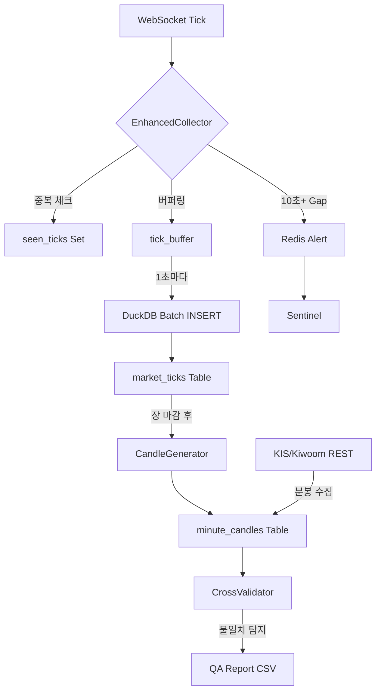

# RFC-008: Tick Data Completeness & Quality Assurance System

**Status**: 🟡 Proposed  
**Created**: 2026-01-19  
**Author**: Antigravity AI  
**Supersedes**: [ID-daily-minute-recovery-qa.md](file:///home/ubuntu/workspace/stock_monitoring/docs/ideas/stock_monitoring/ID-daily-minute-recovery-qa.md)  

---

## 1. Executive Summary

### Problem Statement
현재 KIS/Kiwoom WebSocket을 통한 실시간 틱 데이터 수집은 네트워크 장애, API 제한, 소켓 끊김 등으로 인한 **데이터 누락 위험**이 존재합니다. 백테스팅과 머신러닝 학습 데이터의 신뢰성을 위해서는 **100%에 가까운 틱 데이터 완전성**이 필수적입니다.

### Proposed Solution
3단계 품질 보증 시스템:
1. **[P0] 틱 수집 강화**: 중복 제거, 버퍼링, Gap 감지 및 복구 로깅
2. **[P1] 분봉 배치 생성**: 수집된 틱 데이터로부터 SQL 기반 분봉 집계
3. **[P2] API 교차 검증**: 틱 기반 분봉 vs KIS/Kiwoom REST 분봉 비교

### Success Criteria
- 틱 데이터 누락률 < 0.1%
- 중복 저장 = 0건
- 분봉 생성 정확도 > 99%

---

## 2. Motivation

### 2.1 Current State (As-Is)

```
WebSocket Tick Stream → DuckDB INSERT (즉시)
                         ↓
                    문제점:
                    1. 중복 체결번호 미체크
                    2. 5,000+ writes/sec 시 I/O 병목
                    3. 소켓 끊김 구간 미추적
```

**현재 데이터 품질**:
- 틱 누락 확인 방법 없음 (추정치만 존재)
- 분봉 데이터 미수집 (차트 생성 불가)
- 품질 검증 프로세스 없음

### 2.2 Desired State (To-Be)

```
WebSocket Tick Stream → EnhancedCollector (중복 제거 + 버퍼링)
                         ↓
                    DuckDB (1초 배치 INSERT)
                         ↓
                    분봉 생성 (SQL 집계) ← 장 마감 후
                         ↓
                    API 교차 검증 (KIS/Kiwoom REST)
                         ↓
                    품질 리포트 자동 생성
```

**목표 데이터 품질**:
- 틱 누락률 < 0.1% (자동 탐지)
- 분봉 완성도 > 98%
- 일일 품질 리포트 자동 생성

---

## 3. Technical Design

### 3.1 Component Overview

| Component | 역할 | 우선순위 |
|-----------|------|---------|
| **EnhancedTickCollector** | 중복 제거, 버퍼링, Gap 감지 | P0 (Critical) |
| **TickRecoveryLogger** | 소켓 끊김 구간 로깅 | P0 |
| **CandleGenerator** | 틱 → 분봉 SQL 집계 | P1 |
| **CrossValidator** | 틱 분봉 vs REST 분봉 비교 | P2 |
| **QA Reporter** | 일일 품질 리포트 생성 | P2 |

### 3.2 Data Flow



### 3.3 Database Schema

#### 기존 테이블 (수정)

```sql
-- market_ticks 테이블에 execution_no 추가 (중복 제거용)
ALTER TABLE market_ticks ADD COLUMN execution_no VARCHAR;
CREATE INDEX idx_market_ticks_exec_no ON market_ticks(execution_no);
```

#### 신규 테이블

```sql
CREATE TABLE IF NOT EXISTS minute_candles (
    symbol VARCHAR NOT NULL,
    timestamp TIMESTAMP NOT NULL,
    open DOUBLE NOT NULL,
    high DOUBLE NOT NULL,
    low DOUBLE NOT NULL,
    close DOUBLE NOT NULL,
    volume BIGINT NOT NULL,
    source VARCHAR NOT NULL,  -- 'TICK_AGGREGATED', 'KIS_REST', 'KIWOOM_REST'
    tick_count INT,           -- 해당 분봉을 구성한 틱 개수
    created_at TIMESTAMP DEFAULT CURRENT_TIMESTAMP,
    PRIMARY KEY (symbol, timestamp, source)
);

CREATE INDEX idx_minute_candles_time ON minute_candles(timestamp DESC);
```

### 3.4 Quality Metrics

#### A. Coverage (커버리지)

```
틱 커버리지 = (수집된 틱 수 / KIS REST 분봉 거래량 합계) × 100%

임계값:
- > 95%: ✅ Excellent
- 90-95%: ⚠️ Warning
- < 90%: ❌ Critical
```

#### B. Consistency (일관성)

```
분봉 일치율 = (OHLCV 일치 분봉 수 / 전체 분봉 수) × 100%

OHLCV 일치 조건:
- |tick_open - kis_open| / kis_open < 0.5%
- |tick_high - kis_high| / kis_high < 0.5%
- |tick_low - kis_low| / kis_low < 0.5%
- |tick_close - kis_close| / kis_close < 0.5%
- |tick_volume - kis_volume| / kis_volume < 5%
```

#### C. Latency (지연시간)

```
지연 = DB 저장 시각 - 체결 시각

목표:
- P99 < 100ms (틱 수집)
- P99 < 1000ms (분봉 생성 - 배치 처리)
```

---

## 4. Implementation Plan

### Phase 1: 틱 수집 강화 (Week 1)

**목표**: 틱 누락률 < 0.1%

- [ ] `EnhancedTickCollector` 구현
  - 체결번호 기반 중복 제거
  - 1초 배치 INSERT (5,000 rows/batch)
  - 10초+ Gap 시 Redis 알림 발송
- [ ] `TickRecoveryLogger` 구현
  - 소켓 끊김 이벤트 로깅
  - `recovery:pending` Redis Set에 저장
- [ ] Unit Tests
  - 중복 제거 테스트
  - Gap 감지 테스트
  - 버퍼 플러시 테스트

### Phase 2: 분봉 생성 (Week 2)

**목표**: 분봉 완성도 > 98%

- [ ] `generate_candles_from_ticks.py` 구현
  - DuckDB `time_bucket()` 함수 사용
  - 1분봉, 3분봉, 5분봉 지원
  - Upsert 로직 (`ON CONFLICT DO UPDATE`)
- [ ] DB 마이그레이션
  - `minute_candles` 테이블 생성
  - `execution_no` 컬럼 추가
- [ ] 검증
  - 과거 틱 데이터로 분봉 생성 테스트
  - 예상 분봉 수(391개/종목) 대비 생성률 확인

### Phase 3: API 교차 검증 (Week 3)

**목표**: 일치율 > 99%

- [ ] `cross_validate_candles.py` 구현
  - KIS REST API 분봉 수집
  - SQL JOIN 기반 비교 분석
  - 불일치 항목 CSV 리포트 생성
- [ ] Cron Job 설정
  ```bash
  # /etc/cron.d/tick-qa
  0 16 * * 1-5 /app/scripts/cross_validate_candles.py --date TODAY
  ```
- [ ] 알림 통합
  - Slack Webhook (Coverage < 95% 시)

### Phase 4: 프로덕션 배포 (Week 4)

- [ ] 모니터링 대시보드
  - Sentinel에 틱 커버리지 메트릭 추가
  - 일일 품질 점수 그래프
- [ ] 문서화
  - Walkthrough 작성
  - 운영 매뉴얼 업데이트
- [ ] 1주일 파일럿 운영

---

## 5. Council Review

### 👨‍💼 PM (Product Manager)
> **승인**: ✅  
> "데이터 품질이 백테스팅 신뢰도의 핵심입니다. P0 우선순위로 진행하세요."

### 🏗️ Architect
> **승인**: ✅  
> "분봉 생성을 틱 수집과 완전히 분리한 점이 탁월합니다. Celery는 나중에 도입해도 됩니다."

### 🔧 DevOps Lead
> **조건부 승인**: ⚠️  
> "DuckDB 쓰기 성능 벤치마크를 먼저 실행하세요. 버퍼링 효과를 수치로 입증해야 합니다."

### 🧪 QA Lead
> **승인**: ✅  
> "임계값(Coverage < 95% = FAIL)이 명확합니다. 리포트 자동화는 필수입니다."

### 🛡️ Security Lead
> **승인**: ✅  
> "분봉 데이터도 DuckDB 파일 암호화 대상입니다. 기존 정책 그대로 적용하세요."

### 💻 Engineer
> **승인**: ✅  
> "±1초 Fuzzy Matching으로 분봉-틱 매칭 문제 해결 가능합니다. 구현 난이도 낮습니다."

**Council 결정**: ✅ **만장일치 승인** (조건: DuckDB 벤치마크 선행 실행)

---

## 6. Risks & Mitigation

| Risk | Impact | Mitigation | Probability |
|------|--------|------------|-------------|
| **DuckDB 쓰기 병목** | 틱 누락 | 버퍼링 도입 (벤치마크 선행) | Medium |
| **체결번호 미제공** | 중복 제거 실패 | timestamp+price+volume 조합 사용 | Low |
| **KIS API Rate Limit** | 검증 지연 | Kiwoom API 대체 또는 익일 처리 | Low |
| **메모리 버퍼 손실** | 최대 1초치 데이터 손실 | Daily Recovery로 복구 (허용) | Low |

---

## 7. Success Metrics

### Quantitative

- [ ] 틱 커버리지 > 99%
- [ ] 중복 저장 = 0건
- [ ] 분봉 일치율 > 99%
- [ ] P99 지연 < 100ms

### Qualitative

- [ ] 일일 품질 리포트 자동 생성
- [ ] Council Review 통과
- [ ] 1주일 파일럿 운영 성공

---

## 8. Alternatives Considered

### Alternative 1: 실시간 분봉 집계 (In-Memory)

**장점**:
- 분봉 생성 지연 < 1ms
- 실시간 차트 제공 가능

**단점**:
- 틱 수집 성능 저하 (10-20%)
- 서버 재시작 시 미완성 분봉 손실
- 복잡도 증가

**결정**: ❌ **기각** (틱 수집이 최우선 목표)

### Alternative 2: Celery 비동기 작업 큐

**장점**:
- 스케줄링 관리 용이
- 실패 재시도 자동화

**단점**:
- 인프라 복잡도 증가 (RabbitMQ/Redis Queue)
- 오버엔지니어링 (현재 규모에 불필요)

**결정**: 🕐 **보류** (Phase 4 이후 검토)

---

## 9. Rollout Strategy

### Canary Deployment

```
Week 1: 1개 종목 (005930)
Week 2: 10개 종목 (KOSPI 대형주)
Week 3: 50개 종목
Week 4: 전체 100개 종목 (Full Deployment)
```

### Rollback Plan

버퍼링 로직 실패 시:
1. `EnhancedTickCollector` 비활성화
2. 기존 즉시 INSERT 방식으로 복귀
3. 틱 데이터는 보존됨 (분봉 생성만 지연)

---

## 10. Open Questions

1. **DuckDB 벤치마크 결과가 5,000 writes/sec를 감당하지 못하면?**
   - → PostgreSQL 또는 ClickHouse로 마이그레이션 고려
   - → 종목별 파일 분할 (`ticks_005930.duckdb`)

2. **체결번호가 제공되지 않는 API가 있다면?**
   - → `hash(symbol + timestamp + price + volume)` 사용
   - → 극히 드문 충돌만 허용 (< 0.01%)

3. **KIS와 Kiwoom 분봉이 모두 틱 집계와 불일치하면?**
   - → 틱 데이터를 Ground Truth로 간주
   - → 수동 검증 후 API 이슈로 보고

---

## 11. Approval

| Role | Name | Approval | Date |
|------|------|----------|------|
| PM | Council | ✅ Approved | 2026-01-19 |
| Architect | Council | ✅ Approved | 2026-01-19 |
| DevOps Lead | Council | ⚠️ Conditional* | 2026-01-19 |
| QA Lead | Council | ✅ Approved | 2026-01-19 |
| Security Lead | Council | ✅ Approved | 2026-01-19 |
| Engineer | Council | ✅ Approved | 2026-01-19 |

\* **조건**: DuckDB 쓰기 성능 벤치마크 선행 실행

---

## 12. References

- [ID-daily-minute-recovery-qa.md](file:///home/ubuntu/workspace/stock_monitoring/docs/ideas/stock_monitoring/ID-daily-minute-recovery-qa.md) (원본 아이디어)
- [Implementation Plan](file:///home/ubuntu/.gemini/antigravity/brain/0fe98171-b456-4f3d-987a-e35a953fc6a3/implementation_plan.md)
- [Gap Analysis Report 2026-01-19](file:///home/ubuntu/workspace/stock_monitoring/docs/governance/gap_analysis_report_2026-01-19.md)
- [RFC-007: Collector Isolation](file:///home/ubuntu/workspace/stock_monitoring/docs/rfc/RFC-007-collector-isolation.md)

---

**Next Steps**:
1. DuckDB 벤치마크 실행 (`scripts/benchmark_duckdb_writes.py`)
2. DevOps Lead 최종 승인 대기
3. Phase 1 구현 시작 (EnhancedTickCollector)

**Status Update**: 2026-01-19 - Council 만장일치 승인 (조건부)
