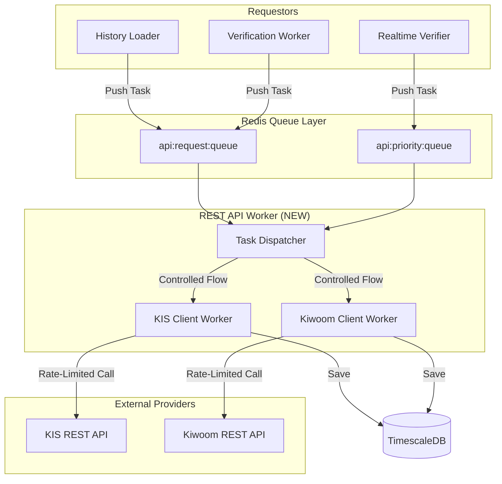

# Specification: Unified API Hub (src.api_gateway.clients)

**Version**: 1.0  
**Status**: 🛠️ Draft (Review Required)  
**Date**: 2026-01-23  
**Owner**: Council of Six

---

## 1. 개요 (Overview)

### 1.1 목적
- 프로젝트 내 분산된 외부 API(KIS, Kiwoom) 호출 로직을 중앙 집중화.
- 모든 API 호출에 대해 Redis Gatekeeper를 통한 전역 스로틀링 강제.
- 데이터 모델 표준화를 통한 모듈 간 정합성 확보.

### 1.2 범위
- KIS REST API (국내 주식 분봉, 틱, 호가)
- Kiwoom REST API (국내 주식 분봉)
- 공통 데이터 모델 및 예외 처리 레이어

---

## 2. 시스템 아키텍처 (Queue-based API Hub)

기존의 클라이언트 분산 호출 방식에서 **"중앙 리퀘스트 큐 + 전담 워커"** 모델로 전환합니다.



---

## 3. 리퀘스트 인터페이스 (Queue Protocol)

### 3.1 Request Task Schema
모든 요청은 Redis List(`api:request:queue`)에 JSON 형태로 인입됩니다.

```json
{
    "task_id": "uuid-v4",
    "priority": "HIGH|NORMAL",
    "provider": "KIS|KIWOOM",
    "tr_id": "FHKST01010300",
    "params": {
        "symbol": "005930",
        "time_code": "100000"
    },
    "timestamp": "2026-01-23T00:23:00Z",
    "callback_key": "optional:res:uuid"
}
```

### 3.2 REST API Worker (Consumer) 책임
- **Rate Limiting**: Redis Gatekeeper를 사용하여 1초에 정해진 수(30 TPS)만큼만 큐에서 팝(Pop)하여 처리합니다.
- **Priority Handling**: `api:priority:queue`를 우선 소비하여 실시간 검증 작업을 먼저 처리합니다.
- **Auth Management**: 토큰 갱신 및 관리를 워커가 전담합니다.
- **Result Handling**: 복구나 로딩 작업의 경우 직접 DB에 적재하거나, 특정 토픽으로 결과를 브로드캐스트합니다.

### 3.2 KISClient
| 메서드 | TR ID | 설명 | 리턴 타입 |
|--------|-------|------|-----------|
| `fetch_minute_candles` | `FHKST03010200` | 분봉 조회 | `List[CandleModel]` |
| `fetch_ticks` | `FHKST01010300` | 틱 데이터 조회 | `List[TickModel]` |
| `fetch_orderbook` | `FHKST01010200` | 실시간 호가 조회 | `OrderbookModel` |

### 3.3 KiwoomClient
| 메서드 | TR ID | 설명 | 리턴 타입 |
|--------|-------|------|-----------|
| `fetch_minute_candles` | `ka10080` | 분봉 조회 | `List[CandleModel]` |

---

## 4. 데이터 모델 (Data Structures)

### 4.1 CandleModel (Pydantic)
```python
class CandleModel(BaseModel):
    time: datetime        # UTC 기준
    symbol: str
    open: float
    high: float
    low: float
    close: float
    volume: int
    source_type: str      # 'REST_API_KIS', 'REST_API_KIWOOM' 등
```

### 4.2 TickModel (Pydantic)
```python
class TickModel(BaseModel):
    time: datetime
    symbol: str
    price: float
    volume: int
    change: float
    source: str
    execution_no: str     # 고유 식별자
```

---

## 5. 전역 스로틀링 전략 (Global Throttling)

### 5.1 토큰 버킷 정책
- **KIS**: 30 TPS (Burst 5)
- **Kiwoom**: 30 TPS (Burst 5)

### 5.2 강제 및 제어 메커니즘 (Queue Throttling)

기존 클라이언트 사이드 스로틀링(`wait_acquire`)을 폐기하고, 워커 레벨에서 **"물리적 호출 빈도"**를 제어합니다.

- **Queue Consumption Control**: `REST API Worker`가 Redis List에서 데이터를 Pop할 때 Gatekeeper의 토큰을 획득해야만 실행되도록 설계하여 엔드포인트별 TPS를 중앙에서 엄격히 통제합니다.
- **Priority Dispatching**: 실시간 검증용 `api:priority:queue`를 선순위로 소비하여 지연시간(Latency)을 최소화합니다.
- **Circuit Breaker Integration**: 외부 API 응답 지연이나 429 에러 발생 시, 워커가 큐 소비를 즉시 중단(Backpressure)하고 대기 상태로 전환하여 시스템 전체에 전파되는 것을 방지합니다.

---

## 6. 토큰 및 보안 정책 (Auth & Token SSoT)

[RFC-008 Appendix G] 실험 결과에 따라 REST API와 WebSocket 간의 **토큰 공유 시스템**을 구축합니다.

- **Centralized Manager**: `REST API Worker` 내부의 `TokenManager`가 토큰 발급 및 주기적 갱신을 전담합니다.
- **Redis SSoT**: 발급된 토큰과 만료 시간은 Redis(`api:token:kis`, `api:token:kiwoom`)에 저장되어 모든 모듈이 동일한 토큰을 사용하도록 보장합니다.
- **WS Session Survival**: 토큰 갱신 시에도 기존 웹소켓 세션이 유지됨을 확인하였으므로(Survival Window), 갱신 직후 Redis를 통해 전역적으로 전파합니다.

| 상황 | 대응 전략 |
|------|----------|
| **HTTP 429** | Gatekeeper 동기화 오류로 간주, 1초 대기 후 재시도 (최대 3회) |
| **HTTP 5xx** | 증권사 서버 장애, `ExternalAPIError` 발생 및 Sentinel 알림 |
| **Timeout** | 10초 기준 타임아웃, 회로 차단(Circuit Breaker) 후보 |
| **Auth Fail** | 토큰 즉시 무효화 및 재발급 프로세스 트리거 |

---

## 7. 의존성 (Dependencies)
- `aiohttp`: 비동기 통신
- `pydantic`: 데이터 검증 및 모델링
- `redis.asyncio`: Gatekeeper 통신
- `src.api_gateway.rate_limiter`: 중앙 스로틀 제어

---

---

## 8. 향후 확장성
- 해외 주식 API 통합 (KIS/Kiwoom 해외 TR)
- 가상화폐 API 플러그인 (Upbit/Binance)
- API 호출 통계(Latency, Success Rate) Prometheus 메트릭 전송

### 🔗 참조 설계 및 실험 근거
- **[RFC-008 Appendix G]**: [Kiwoom Token Behavior Verification](file:///home/ubuntu/workspace/stock_monitoring/docs/governance/rfc/RFC-008-tick-completeness-qa.md#L2012)
  - REST API와 WebSocket 간의 토큰 공유 및 생존(Survival) 실험 완료.
  - 신규 토큰 발급 시 기존 웹소켓 세션 유지 가능 여부 검증됨.
- **[RFC-009]**: [Ground Truth & API Control Policy](file:///home/ubuntu/workspace/stock_monitoring/docs/governance/rfc/RFC-009-ground-truth-api-control.md)

---

**Document Status**: 🌳 Mature (Ready for Review)
