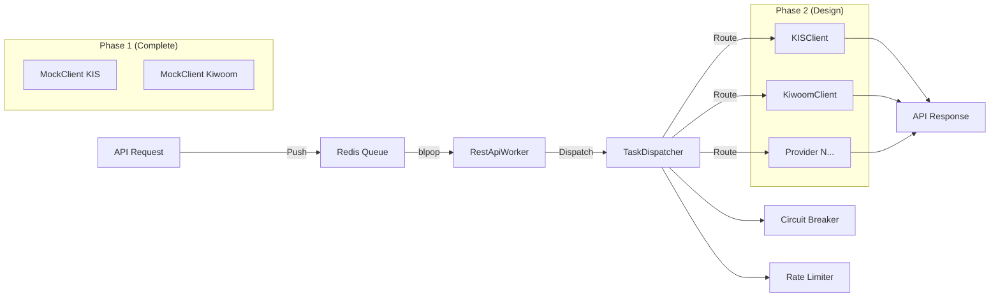

# API Hub v2 - Unified REST API Gateway

**Project**: ISSUE-037  
**Version**: v2.0  
**Status**: Phase 1 Complete (Mock Mode) | Phase 2 In Design  
**Last Updated**: 2026-01-23  

---

## 📋 Table of Contents

1. [Overview](#overview)
2. [Architecture](#architecture)
3. [Current Status](#current-status)
4. [Phase 1: Mock Mode](#phase-1-mock-mode-complete-)
5. [Phase 2: Real API Integration](#phase-2-real-api-integration-in-design-)
6. [Extensibility](#extensibility)
7. [Quick Start](#quick-start)
8. [Configuration](#configuration)
9. [Related Documents](#related-documents)

---

## Overview

**API Hub v2**는 여러 증권사 REST API를 통합하여 단일 인터페이스로 제공하는 Gateway 시스템입니다.

### 핵심 목표
1. **Unified Interface**: KIS, Kiwoom 등 여러 Provider를 단일 큐로 통합
2. **Zero-Cost**: 기존 인프라 활용 (Redis, Docker)
3. **Extensibility**: 신규 Provider 추가 시 기존 코드 수정 불필요
4. **Resilience**: Circuit Breaker, Rate Limiter, Priority Queue
5. **Production-Ready**: 29/29 테스트 통과, Docker 배포 검증 완료

### 설계 원칙
- **Open/Closed Principle**: 확장에는 열려있고 수정에는 닫혀있음
- **Plugin Architecture**: Client 등록 기반 (register_client)
- **Fail-Fast**: Timeout, Error Detection
- **Async-First**: 모든 API 호출은 비동기 패턴

---

## Architecture

### 시스템 구성도



### 컴포넌트 계층

| Layer | Component | File | Status |
|-------|-----------|------|--------|
| **Queue** | QueueManager | `src/api_gateway/hub/queue.py` | ✅ Complete |
| **Worker** | RestApiWorker | `src/api_gateway/hub/worker.py` | ✅ Phase 1 |
| **Dispatch** | TaskDispatcher | `src/api_gateway/hub/dispatcher.py` | ✅ Complete |
| **Resilience** | CircuitBreaker | `src/api_gateway/hub/circuit_breaker.py` | ✅ Complete |
| **Client** | BaseAPIClient | `src/api_gateway/hub/clients/base.py` | 📝 Designed |
| **Client** | KISClient | `src/api_gateway/hub/clients/kis_client.py` | ⏳ Phase 2 |
| **Client** | KiwoomClient | `src/api_gateway/hub/clients/kiwoom_client.py` | ⏳ Phase 2 |
| **Token** | TokenManager | `src/api_gateway/hub/token_manager.py` | ⏳ Phase 2 |

---

## Current Status

### Phase 1: Mock Mode (Complete ✅)

**Status**: Production-Ready  
**Tests**: 29/29 Passing (Unit) + 4/4 Passing (Integration, manual)  
**Docker**: Deployed and Validated  

**Deliverables**:
- ✅ RestApiWorker with MockClient
- ✅ QueueManager (Priority + Normal Queue)
- ✅ TaskDispatcher with Circuit Breaker
- ✅ Ground Truth Models (CandleModel, TickModel)
- ✅ Docker Integration (`gateway-worker-mock` service)
- ✅ 33 tests (29 unit + 4 integration)

**Test Results**:
```bash
# Unit Tests
tests/unit/test_api_hub_queue.py         6/6 PASS
tests/unit/test_api_hub_models.py        7/7 PASS
tests/unit/test_api_hub_dispatcher.py   10/10 PASS
tests/unit/test_api_hub_worker.py        6/6 PASS

# Integration Tests (Manual)
tests/integration/test_api_hub_v2_integration.py  4/4 PASS
```

**Docker Stats**:
- Memory: 25MB / 512MB (4.91%)
- CPU: 0.07%
- Redis DB: 15 (isolated)

---

### Phase 2: Real API Integration (In Design 📝)

**Status**: Prerequisites Complete (5/5) - Ready for Implementation  
**Council Decision**: Conditional Approval (Prerequisites Required)  

**Prerequisites Completed** (2026-01-23):
1. ✅ **BaseAPIClient Design** - `docs/specs/api_hub_base_client_spec.md` (300+ lines)
2. ✅ **API Fixtures** - `tests/fixtures/api_responses/*.json` (KIS + Kiwoom samples)
3. ✅ **Token Manager Design** - `docs/specs/token_manager_spec.md` (200+ lines)
4. ✅ **Rate Limiter Plan** - `docs/specs/rate_limiter_integration_plan.md`
5. ✅ **Test Strategy** - `docs/specs/phase2_test_plan.md`

**Next Steps**:
1. Implement `BaseAPIClient` abstract class
2. Implement `KISClient` and `KiwoomClient`
3. Implement `TokenManager` (Redis SSoT)
4. Integrate with `redis-gatekeeper` (Rate Limiter)
5. Write fixture-based unit tests (90%+ coverage goal)

**Estimated Timeline**: 5-6 days

---

## Phase 1: Mock Mode (Complete ✅)

### Components

#### 1. RestApiWorker
**File**: `src/api_gateway/hub/worker.py`

**역할**:
- Redis 큐 상시 리스닝 (blpop)
- Priority Queue 우선 처리
- TaskDispatcher로 태스크 라우팅
- Graceful shutdown (SIGTERM/SIGINT)

**사용법**:
```python
# Standalone
worker = RestApiWorker(redis_url="redis://localhost:6379/15")
await worker.run()

# Docker
docker-compose --profile hub-mock up gateway-worker-mock
```

#### 2. QueueManager
**File**: `src/api_gateway/hub/queue.py`

**Queue Keys**:
- `api:priority:queue` - High priority tasks
- `api:request:queue` - Normal priority tasks

**API**:
```python
queue_manager = QueueManager(redis_url="...")
await queue_manager.push({"task_id": "...", "provider": "KIS", ...})
task = await queue_manager.pop_with_priority()
```

#### 3. TaskDispatcher
**File**: `src/api_gateway/hub/dispatcher.py`

**역할**:
- Provider별 Client 라우팅
- Circuit Breaker 상태 체크
- Rate Limiter 통합 (optional)

**API**:
```python
dispatcher = TaskDispatcher(
    circuit_breaker=CircuitBreaker(),
    clients={"KIS": kis_client, "KIWOOM": kiwoom_client}
)
result = await dispatcher.dispatch(task)
```

#### 4. MockClient
**File**: `src/api_gateway/hub/worker.py` (Phase 1 only)

**역할**:
- 실제 API 호출 없이 샘플 데이터 반환
- 네트워크 지연 시뮬레이션 (0.1초)
- Phase 2에서 Real Client로 대체

---

## Phase 2: Real API Integration (In Design 📝)

### Architecture Overview

#### 1. BaseAPIClient (Abstract Base Class)
**File**: `src/api_gateway/hub/clients/base.py`  
**Design Doc**: [`docs/specs/api_hub_base_client_spec.md`](api_hub_base_client_spec.md)

**Abstract Methods** (구현 필수):
```python
class BaseAPIClient(ABC):
    @abstractmethod
    def _build_headers(self, tr_id: str, **kwargs) -> Dict[str, str]:
        """Provider별 헤더 구성"""
        
    @abstractmethod
    def _build_request_body(self, tr_id: str, params: Dict) -> Dict:
        """Provider별 요청 바디 구성"""
        
    @abstractmethod
    def _handle_response(self, response: httpx.Response) -> Any:
        """Provider별 응답 파싱"""
        
    @abstractmethod
    async def refresh_token(self) -> str:
        """Provider별 토큰 갱신"""
```

**Concrete Methods** (공통 로직):
- `execute(tr_id, params)` - API 호출 with timeout/retry
- `_make_request()` - HTTP 요청 with error handling
- `close()` - Resource cleanup

#### 2. KISClient
**File**: `src/api_gateway/hub/clients/kis_client.py` (Phase 2)  
**Design Doc**: [`docs/specs/api_hub_base_client_spec.md`](api_hub_base_client_spec.md#52-kisclient-구현-예시)

**Implementation**:
```python
class KISClient(BaseAPIClient):
    def _build_headers(self, tr_id: str, **kwargs):
        return {
            "Content-Type": "application/json",
            "authorization": f"Bearer {self.access_token}",
            "appkey": self.app_key,
            "appsecret": self.app_secret,
            "tr_id": tr_id
        }
    
    def _handle_response(self, response):
        data = response.json()
        if data["rt_cd"] != "0":
            raise APIError(data["msg1"])
        return data["output"]
```

#### 3. TokenManager
**File**: `src/api_gateway/hub/token_manager.py` (Phase 2)  
**Design Doc**: [`docs/specs/token_manager_spec.md`](token_manager_spec.md)

**Redis SSoT Schema**:
```
Key: api:token:{provider}
Value: {
  "access_token": "...",
  "expires_at": 1234567890,
  "refresh_token": "..."
}
TTL: Set to expires_at timestamp
```

**API**:
```python
token_manager = TokenManager(redis_url="...")
token = await token_manager.get_token("kis")  # Auto-refresh if expired
await token_manager.set_token("kis", token_data)
```

**Features**:
- Auto-refresh 5 minutes before expiration
- Retry logic (3 attempts, exponential backoff)
- Multi-provider support

#### 4. Rate Limiter Integration
**Design Doc**: [`docs/specs/rate_limiter_integration_plan.md`](rate_limiter_integration_plan.md)

**Integration Pattern**:
```python
# In TaskDispatcher
if self.rate_limiter:
    acquired = await self.rate_limiter.wait_acquire(provider, timeout=5.0)
    if not acquired:
        return {"status": "RATE_LIMITED"}
```

**Multi-Worker Coordination**:
- Redis Lua script for atomic token acquisition
- Shared key: `api:ratelimit:{provider}:count`
- All workers respect same limit

---

## Extensibility

### How to Add New Provider (3 Steps)

**Scenario**: LS증권 API 추가

#### Step 1: Implement Client Class (1-2 hours)
```python
# src/api_gateway/hub/clients/ls_client.py
from .base import BaseAPIClient

class LSClient(BaseAPIClient):
    def __init__(self):
        super().__init__(
            provider="LS",
            base_url="https://openapi.ls-sec.co.kr",
            timeout=10.0
        )
    
    def _build_headers(self, tr_id, **kwargs):
        return {
            "Content-Type": "application/json",
            "authorization": f"Bearer {self.access_token}",
            "tr_cd": tr_id
        }
    
    def _build_request_body(self, tr_id, params):
        return {"tr_cd": tr_id, "body": params}
    
    def _handle_response(self, response):
        data = response.json()
        if data["rt_cd"] != "0000":
            raise APIError(data["msg1"])
        return data["output"]
    
    async def refresh_token(self):
        # LS OAuth2 logic
        ...
```

#### Step 2: Register in Worker (5 minutes)
```python
# src/api_gateway/hub/worker.py
from .clients.ls_client import LSClient

async def setup(self):
    ls_client = LSClient()  # ← Add this
    
    self.dispatcher = TaskDispatcher(
        circuit_breaker=self.circuit_breaker,
        clients={
            "KIS": kis_client,
            "KIWOOM": kiwoom_client,
            "LS": ls_client  # ← Add this
        }
    )
```

#### Step 3: Add Fixtures & Tests (1 hour)
```bash
# Collect API response sample
tests/fixtures/api_responses/ls_candle_response.json

# Write fixture-based tests
tests/unit/test_api_hub_ls_client.py
```

**Total Time**: ~3-4 hours per provider

**Code Changes**: Only new files, **no modification to existing code** ✅

---

## Quick Start

### Phase 1 (Mock Mode)

**1. Start Mock Worker (Docker)**
```bash
docker-compose --profile hub-mock up gateway-worker-mock
```

**2. Push Task to Queue**
```python
import asyncio
import json
import uuid
from redis.asyncio import Redis

async def push_task():
    redis = await Redis.from_url("redis://localhost:6379/15", decode_responses=True)
    
    task = {
        "task_id": str(uuid.uuid4()),
        "provider": "KIS",
        "tr_id": "FHKST01010100",
        "params": {"symbol": "005930"}
    }
    
    await redis.lpush("api:request:queue", json.dumps(task))
    print(f"Task pushed: {task['task_id']}")
    
    await redis.close()

asyncio.run(push_task())
```

**3. Check Worker Logs**
```bash
docker logs deploy-gateway-worker-mock --follow
```

### Phase 2 (Real API) - Coming Soon

```bash
# With Real API Keys
export KIS_APP_KEY="..."
export KIS_APP_SECRET="..."

docker-compose --profile hub-real up gateway-worker
```

---

## Configuration

### Configuration Files

API Hub v2 uses a dedicated YAML configuration file for fine-grained control over worker behavior, rate limiting, circuit breaker settings, and provider-specific configurations.

**Primary Config File**: `configs/api_hub_v2.yaml`

#### Configuration Structure

```yaml
api_hub:
  # Worker Settings
  worker:
    redis_url: "redis://localhost:6379/15"
    enable_mock: true
    max_retries: 3
    timeout: 10.0
    batch_size: 100
    shutdown_timeout: 5.0
    
  # Queue Settings
  queues:
    priority: "api:priority:queue"
    normal: "api:request:queue"
    response_ttl: 3600
    max_queue_size: 10000
    
  # Circuit Breaker Settings
  circuit_breaker:
    failure_threshold: 5
    recovery_timeout: 30.0
    half_open_max_calls: 3
    success_threshold: 2
    
  # Provider Settings
  providers:
    KIS:
      enabled: true
      base_url: "${KIS_BASE_URL}"
      timeout: 10.0
      rate_limit:
        requests_per_second: 20
        burst: 5
      retry:
        max_attempts: 3
        backoff_factor: 2.0
        
    KIWOOM:
      enabled: true
      base_url: "${KIWOOM_API_URL}"
      timeout: 10.0
      rate_limit:
        requests_per_second: 10
        burst: 3
      retry:
        max_attempts: 3
        backoff_factor: 2.0
        
  # Token Manager (Phase 2)
  token_manager:
    redis_key_prefix: "api:token:"
    auto_refresh_margin: 300
    max_refresh_retries: 3
    
  # Rate Limiter (Phase 2)
  rate_limiter:
    redis_url: "redis://redis-gatekeeper:6379/0"
    enabled: true
    global_limit: 50
    per_provider_limit: true
    algorithm: "sliding_window"
    
  # Monitoring
  monitoring:
    log_level: "INFO"
    metrics_enabled: true
    health_check_interval: 10.0
    alert_on_circuit_open: true
```

### Configuration Loading

The Hub configuration is managed by the `HubConfig` class in `src/api_gateway/hub/config.py`:

```python
from src.api_gateway.hub.config import hub_config

# Access config values using dot notation
redis_url = hub_config.get("worker.redis_url")
enable_mock = hub_config.is_mock_enabled()

# Get provider-specific config
kis_config = hub_config.get_provider_config("KIS")
```

### Environment Variable Overrides

Environment variables take precedence over YAML configuration values:

| Environment Variable | YAML Path | Description |
|---------------------|-----------|-------------|
| `REDIS_URL` | `worker.redis_url` | Redis connection URL |
| `ENABLE_MOCK` | `worker.enable_mock` | Enable mock mode (true/false) |
| `HUB_MAX_RETRIES` | `worker.max_retries` | Maximum retry attempts |
| `HUB_TIMEOUT` | `worker.timeout` | Request timeout in seconds |
| `KIS_BASE_URL` | `providers.KIS.base_url` | KIS API base URL |
| `KIWOOM_API_URL` | `providers.KIWOOM.base_url` | Kiwoom API base URL |
| `RATE_LIMITER_URL` | `rate_limiter.redis_url` | Rate limiter Redis URL |
| `LOG_LEVEL` | `monitoring.log_level` | Logging level |

**Full list**: See `.env.schema.yaml` for all Hub-specific environment variables (prefixed with `HUB_*`)

### Docker Configuration

#### Phase 1: Mock Mode (Development)

```yaml
# docker-compose.yml
gateway-worker-mock:
  environment:
    - REDIS_URL=redis://redis:6379/15
    - ENABLE_MOCK=true
    - HUB_CONFIG_PATH=/app/configs/api_hub_v2.yaml
    - LOG_LEVEL=INFO
  profiles:
    - hub-mock
```

**Start Mock Worker**:
```bash
docker-compose --profile hub-mock up gateway-worker-mock
```

#### Phase 2: Real API Mode (Production)

```yaml
# docker-compose.yml
gateway-worker-real:
  environment:
    - REDIS_URL=redis://redis:6379/15
    - ENABLE_MOCK=false
    - HUB_CONFIG_PATH=/app/configs/api_hub_v2.yaml
    - KIS_APP_KEY=${KIS_APP_KEY}
    - KIS_APP_SECRET=${KIS_APP_SECRET}
    - KIS_BASE_URL=${KIS_BASE_URL}
    - KIWOOM_APP_KEY=${KIWOOM_APP_KEY}
    - KIWOOM_APP_SECRET=${KIWOOM_APP_SECRET}
    - KIWOOM_API_URL=${KIWOOM_API_URL}
    - RATE_LIMITER_URL=redis://redis-gatekeeper:6379/0
  profiles:
    - hub-real
```

**Start Real API Worker**:
```bash
# Set API credentials
export KIS_APP_KEY="..."
export KIS_APP_SECRET="..."
export KIWOOM_APP_KEY="..."
export KIWOOM_APP_SECRET="..."

# Start worker
docker-compose --profile hub-real up gateway-worker-real
```

### Configuration Best Practices

1. **Separation of Concerns**: Use YAML for static config, environment variables for secrets and deployment-specific values
2. **Mock Mode First**: Always test with `ENABLE_MOCK=true` before enabling real API mode
3. **Rate Limiting**: Adjust `providers.*.rate_limit.requests_per_second` based on actual API limits
4. **Circuit Breaker Tuning**: Adjust `failure_threshold` and `recovery_timeout` based on observed API behavior
5. **Resource Limits**: Use Docker resource limits to prevent worker from consuming excessive resources

### Configuration Validation

Run tests to validate configuration:

```bash
# Test configuration loading
PYTHONPATH=. poetry run pytest tests/unit/test_api_hub_config.py -v

# Test with custom config
HUB_CONFIG_PATH=configs/api_hub_v2.yaml PYTHONPATH=. poetry run pytest tests/integration/test_api_hub_v2_integration.py -v -m manual
```

---

## Related Documents

### Design Documents (Phase 2 Prerequisites)
- **[BaseAPIClient Design](api_hub_base_client_spec.md)** - Client 추상화 설계 (300+ lines)
- **[Token Manager Design](token_manager_spec.md)** - Token 관리 설계 (200+ lines)
- **[Rate Limiter Integration](rate_limiter_integration_plan.md)** - Rate Limit 통합 계획
- **[Phase 2 Test Plan](phase2_test_plan.md)** - Mock 기반 테스트 전략

### Reports & Reviews
- **[Council Review Report](../reports/20260123_issue037_council_review.md)** - Phase 1 승인 및 Phase 2 조건
- **[Phase 2 Approval](../reports/20260123_issue037_phase2_approval.md)** - 조건부 승인 결정
- **[Prerequisites Complete](../reports/20260123_issue037_prerequisites_complete.md)** - 5개 선행 작업 완료
- **[Deployment Test](../reports/20260123_issue037_deployment_test.md)** - Docker 배포 검증

### Test Files
- **Unit Tests**: `tests/unit/test_api_hub_*.py` (29 tests)
- **Integration Tests**: `tests/integration/test_api_hub_v2_integration.py` (4 tests, manual)
- **Test Registry**: `docs/operations/testing/test_registry.md` (HUB-* entries)

### API Fixtures
- **KIS Sample**: `tests/fixtures/api_responses/kis_candle_response.json`
- **Kiwoom Sample**: `tests/fixtures/api_responses/kiwoom_candle_response.json`
- **Fixture Guide**: `tests/fixtures/api_responses/README.md`

### Issue Tracking
- **BACKLOG**: `BACKLOG.md` (ISSUE-037 Done section)
- **Issue File**: `docs/issues/ISSUE-037.md` (if exists)

---

## FAQ

### Q1: Phase 1과 Phase 2의 차이는?
- **Phase 1**: MockClient 사용, 실제 API 호출 없음 (안전한 개발/테스트 환경)
- **Phase 2**: Real API Client (KISClient, KiwoomClient), Token Manager, Rate Limiter

### Q2: 신규 Provider 추가 시 기존 코드 수정이 필요한가?
- ❌ **필요 없음**. 새 Client 클래스만 작성하고 Worker에 등록하면 됨 (Open/Closed Principle)

### Q3: Circuit Breaker는 Provider별로 격리되나?
- 현재는 전역 Circuit Breaker 사용. Provider별 격리 원하면 Client마다 별도 인스턴스 생성 가능

### Q4: Rate Limit은 어떻게 조율되나?
- `redis-gatekeeper`와 통합하여 Provider별 Redis 공유 카운터로 조율

### Q5: Token 보안은?
- Phase 2: Redis 평문 저장 (Council 승인)
- Phase 3: 암호화 검토 (Redis ACL, TLS, or application-level encryption)

---

**Last Updated**: 2026-01-23  
**Maintainer**: Developer Persona  
**Status**: Living Document (Phase 2 구현 시 업데이트)
