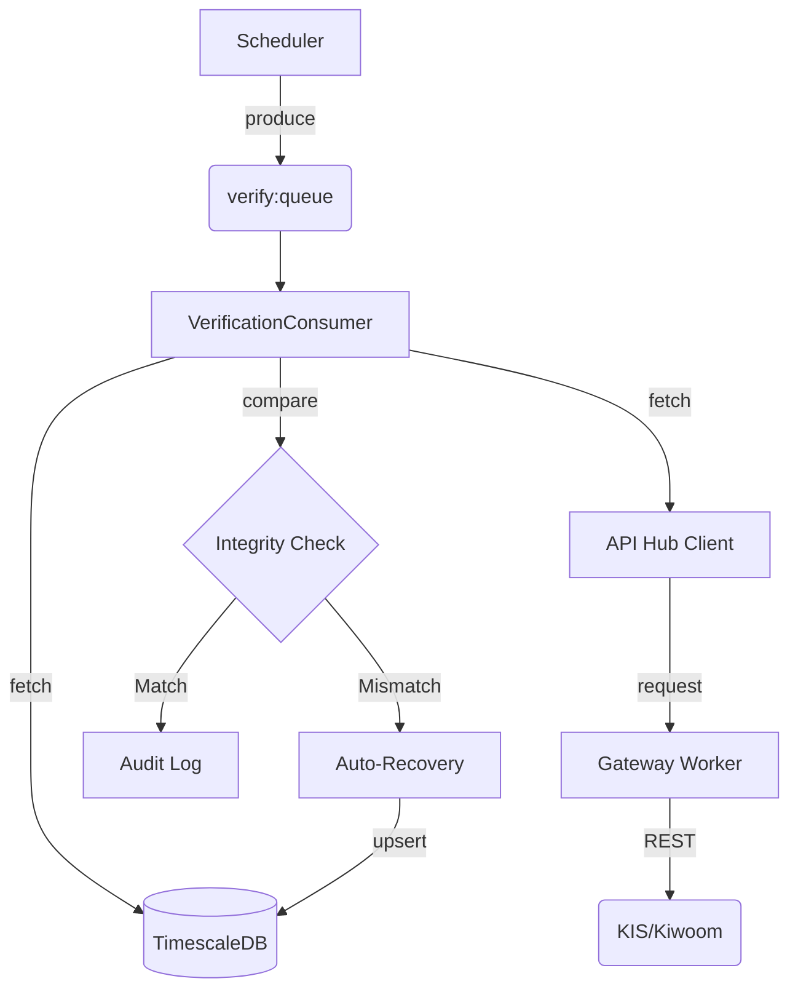

# Unified Verification Worker Specification

**RFC**: [RFC-005](../governance/decisions/RFC-005_unified_verification_architecture.md)
**Related Issue**: [ISSUE-047](../../issues/ISSUE-047.md)
**Role**: Single Source of Truth Enforcement (DB Integrity & API Consistency)

## 1. Overview
The Unified Verification Worker consolidates the legacy `VerificationWorker` (Dual-Source Check) and `RealtimeVerifier` (DB-API Check) into a single, queue-based integrity engine. It ensures that the tick data stored in TimescaleDB (`market_ticks`, `market_candles`) matches the Broker's Ground Truth (REST API) with >99.9% accuracy.

## 2. Architecture
- **Type**: Async Queue Consumer (`verify:queue`)
- **Infrastructure**: redis-backed Throttling (via API Hub)
- **Container**: `verification-worker`

### 2.1 Component Interaction

## 3. Task Types

### 3.1 `verify_db_integrity` (New Core Task)
Verifies that the aggregated data in DB matches the Broker API.
- **Trigger**:
- **Trigger**:
    - Realtime: Every minute (Priority Symbols)
    - **Batch**: **Daily at 15:40 KST (Current Business Day)**
        - *Reason*: Ensures immediate same-day catch-up while Tick API is mostly likely to be available.
- **Logic**:
    1. Fetch `market_candles_1m_view` for target range (Current Day).
    2. Fetch REST API Candles (Ground Truth).
    3. Compare Volume/Price.
    4. If Mismatch (`delta > 0.1%`) or Missing:
        - **Step 1 (Tick Recovery)**: Attempt to fetch Ticks from API and Insert into `market_ticks`.
        - **Step 2 (Fallback)**: If Tick API fails (or empty), Upsert API Candles to `market_candles` and Log `status=TICKS_UNAVAILABLE`.

### 3.2 `recovery` (Legacy -> Integrated)
Executes the fix.
- **Trigger**: By `verify_db_integrity` on mismatch.
- **Logic**: Upsert Correct API Data -> `market_candles`.
    - *Note*: If current day, attempt Tick Recovery. If previous day, Fallback to Candle Upsert.

## 4. Implementation Details
### Class Structure
- `VerificationConsumer`:
    - `_handle_db_integrity_task(task)`: Main logic ported from RealtimeVerifier.
    - `_recover_gap(symbol, time_range)`: Direct execution of recovery.

### Configuration
- `BATCH_TOLERANCE_PCT`: 0.1% (Strict)
- `REALTIME_TOLERANCE_PCT`: 2.0% (Loose due to latency)

## 5. Deployment
- **Docker Service**: `verification-worker`
- **Resources**: 512MB RAM, 0.5 CPU
- **Dependencies**: `timescaledb`, `redis`, `gateway-worker`
