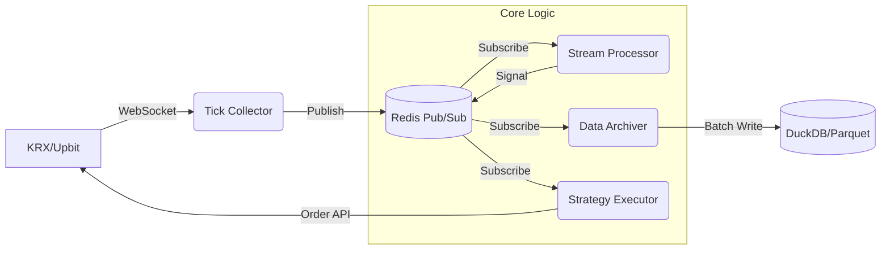

# 상세 아키텍처 설계 (Architecture Design)

## 1. 시스템 조감도 (Overview)
`Asyncio Event Loop`를 기반으로 한 **이벤트 구동(Event-Driven) 아키텍처**를 채택한다. 데이터는 `Redis Pub/Sub`을 통해 느슨하게 결합(Loosely Coupled)된 모듈 사이를 흐른다.



## 2. 컴포넌트 상세 (Components)

### 2.1 Data Ingestion Layer
-   **Collector**: 
    -   `aiohttp` 사용.
    -   역할: 수집, 정규화(Normalize), Redis 전송.
    -   *No Blocking Logic Allowed*.

### 2.2 Messaging Layer (Redis)
-   **Mode**: Pub/Sub (Fire and Forget).
-   **Channels**:
    -   `tick.*`: Raw Ticks.
    -   `signal.*`: Buy/Sell Signals.
    -   `sys.heartbeat`: Alive Check.

### 2.3 Storage Layer
-   **Hot**: Redis (Recent 24h).
-   **Cold**: DuckDB (Interactive Query) + Parquet (Archival).

## 3. 디렉토리 구조 (File Structure)
```
stock_monitoring/
├── configs/            # YAML 설정 파일
├── data/               # 로컬 데이터 저장소
├── docs/               # 문서 (Specs, Planning)
├── src/
│   ├── core/           # Config, Logger, Utils
│   ├── data_ingestion/ # Collector
│   ├── processing/     # Indicators, Features
│   ├── strategy/       # Trading Strategies
│   └── execution/      # Order Management
├── tests/              # Unit & Integration Tests
└── .ai-rules.md        # AI Constitution
```
