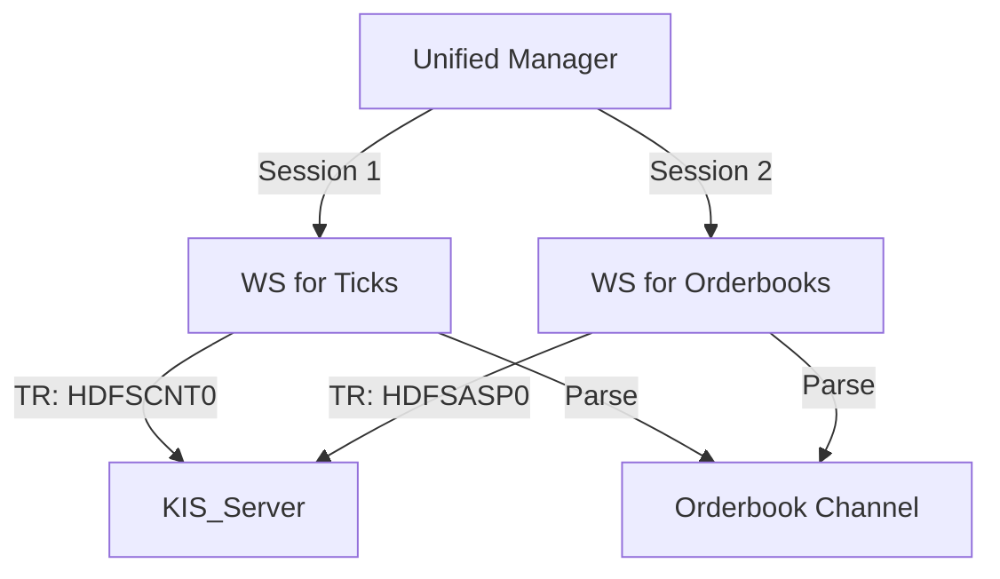

# 📡 Realtime Ingestion Strategy & Configuration

> **Version**: 1.0.0
> **Last Updated**: 2026-01-09
> **Status**: US Tick Verified (Stable) / KR Tick Unverified

이 문서는 실시간 데이터 수집(Ingestion) 레이어의 검증된 설정값(Configuration)과 향후 "Tick + Orderbook" 동시 수집을 위한 아키텍처 전략을 기술한다.

---

## 1. ✅ 검증된 성공 구성 (Verified Configuration)

### 1.1 미국 시장 (US Market)
현재까지의 실험과 디버깅을 통해 **유일하게 성공한 구성**이다. 이 설정을 변경할 때는 반드시 E2E 테스트를 재수행해야 한다.

- **Market Mode**: Realtime Execution (실시간 체결가)
- **Environment**: Production (Ops Server)
- **Protocol**: WebSocket
- **Parameters**:

| 항목 | 설정값 (Value) | 비고 |
| :--- | :--- | :--- |
| **Endpoint URL** | `ws://ops.koreainvestment.com:21000/HDFSCNT0` | **주의**: `/tryitout/` 경로 절대 사용 금지 (Zero Data 원인) |
| **TR_ID** | `HDFSCNT0` | 문서상 `HHDFS00000300`이 언급되기도 하나, 실제로는 `HDFSCNT0`만 동작함 |
| **TR_KEY Format** | `DNASAAPL` | `D`(3자리) + `NAS`(거래소) + `AAPL`(심볼) |
| **Result** | `OPSP0000` (Success) | 틱 데이터 정상 수신 확인 |

> [!IMPORTANT]
> **US TR_ID 혼선 주의**: KIS 문서에 `HHDFS00000300`과 `HDFSCNT0`가 혼재되어 있으나, **`HDFSCNT0`**가 해외주식 실시간 체결가용으로 검증됨.

### 1.2 한국 시장 (KR Market) [Verified]
금일(2026-01-22) 핫픽스 및 실운영 테스트를 통해 검증된 구성이다.

- **Market Mode**: Realtime Ticks (실시간 체결가)
- **Environment**: Production
- **Protocol**: WebSocket
- **Parameters**:

| 항목 | 설정값 (Value) | 비고 |
| :--- | :--- | :--- |
| **Endpoint URL** | `ws://ops.koreainvestment.com:21000/H0STCNT0` | Verified |
| **TR_ID** | **`H0STCNT0`** | 실시간 체결가 전용 |
| **TR_KEY Format** | `005930` | 6자리 종목코드 |
| **Result** | `SUBSCRIBE SUCCESS` | 정상 수신 및 DB 적재 완료 |

---

## 2. ⚔️ 동시 수집 전략 (Concurrent Strategy)

### 2.1 문제 정의 (Problem)
KIS WebSocket 정책상, **단일 소켓 연결**에서는 `체결가(Tick)`와 `호가(Orderbook)` TR을 동시에 완벽하게 처리하기 어렵다.
- **Limit**: 동일 계좌/IP에서 소켓 연결 개수 제한 존재 가능성.
- **Conflict**: 하나의 소켓에서 무거운 호가 데이터와 빠른 틱 데이터가 섞일 경우, **Head-of-Line Blocking** 또는 버퍼 오버플로우로 인한 지연 발생.

### 2.2 해결 전략 (Solution: Multi-Socket Architecture)
단일 프로세스(`UnifiedCollector`) 내에서 `aiohttp`를 활용하여 **2개의 독립된 웹소켓 세션**을 병렬로 유지한다.

#### 아키텍처 다이어그램

#### 구현 계획 (Implementation Steps)
1.  **Dual Connection Manager**: `UnifiedWebSocketManager`를 리팩토링하여 `ws_tick`과 `ws_orderbook` 두 개의 연결 객체 관리.
2.  **Route Splitting**: `subscribe()` 요청 시, TR ID 타입에 따라 적절한 소켓으로 라우팅.
    - `HDFSCNT0`, `H0STCNT0` -> `ws_tick`
    - `HDFSASP0`, `H0STASP0` -> `ws_orderbook`
3.  **Independent Loop**: 두 소켓의 `recv()` 루프를 `asyncio.gather()`로 병렬 실행하여 서로의 지연에 영향받지 않도록 격리.

### 2.3 제약 사항
- **Connection Limit**: KIS의 계좌당 동시 접속 허용 수를 확인해야 함 (통상 2~3개 허용).
- **Resource**: 호가 데이터는 틱 대비 10배 이상의 트래픽을 유발하므로, `Orderbook` 전용 소켓은 별도의 스레드나 프로세스로 분리하는 방안(Option B)도 고려. (현재는 Option A: Asyncio Multi-Session 우선)
