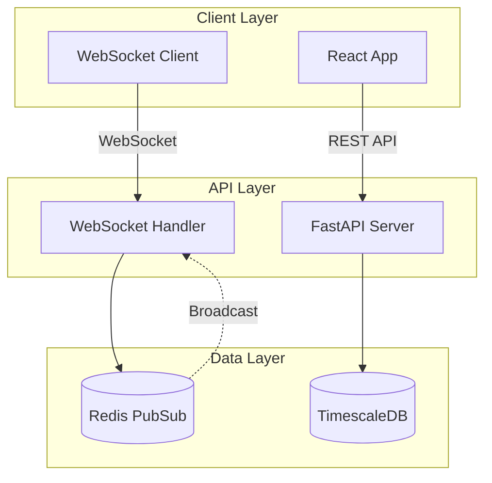
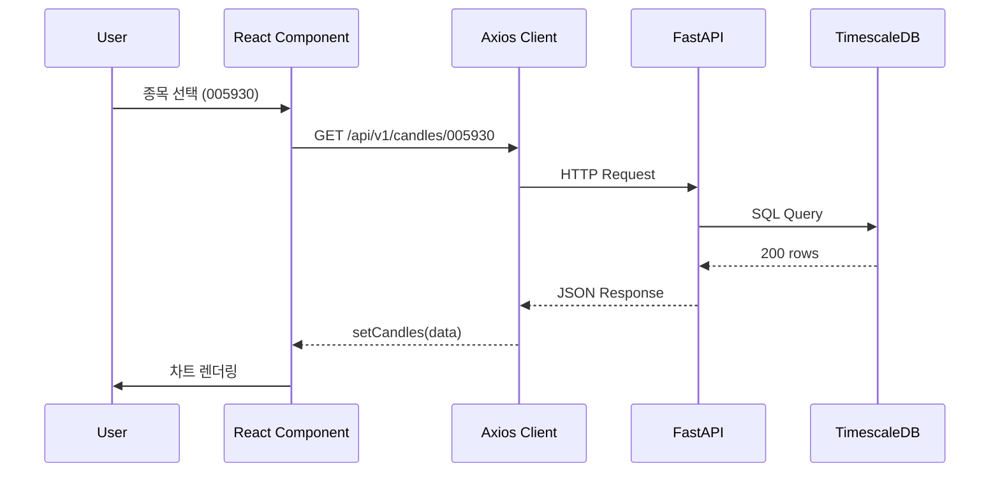
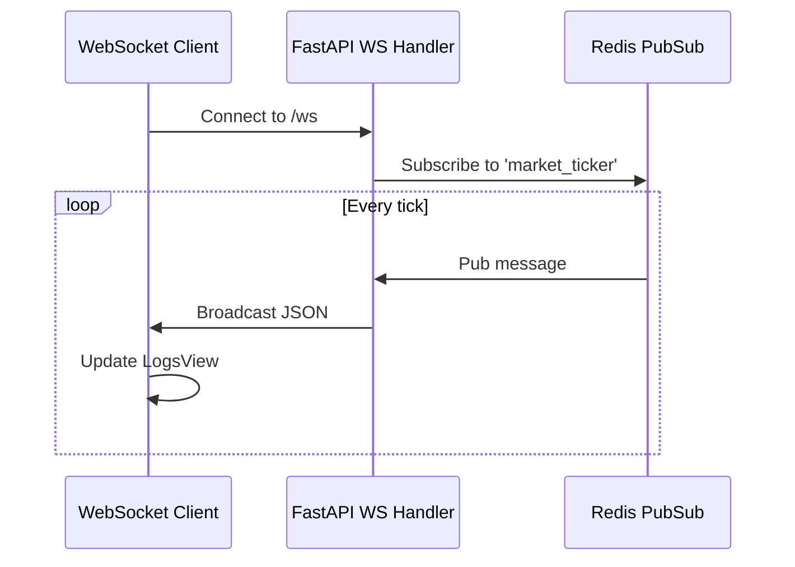
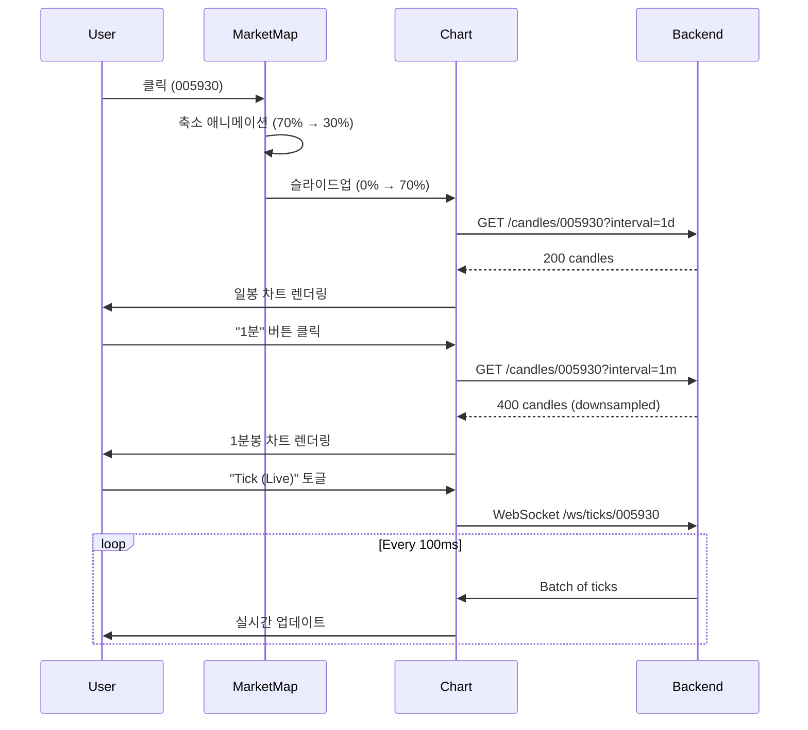

# UI 설계 마스터 문서 (UI Design Master Document)

**Version**: 1.0  
**Last Updated**: 2026-01-12  
**Status**: Active Development

---

## 📋 목차 (Table of Contents)

1. [프로젝트 개요](#1-프로젝트-개요)
2. [UI 아키텍처](#2-ui-아키텍처)
3. [디자인 시스템](#3-디자인-시스템)
4. [컴포넌트 계층 구조](#4-컴포넌트-계층-구조)
5. [데이터 흐름 및 상태 관리](#5-데이터-흐름-및-상태-관리)
6. [API 엔드포인트](#6-api-엔드포인트)
7. [주요 화면 상세](#7-주요-화면-상세)
8. [향후 확장 로드맵](#8-향후-확장-로드맵)

---

## 1. 프로젝트 개요

### 1.1 목표
**Antigravity Stock Monitoring System**은 실시간 주식 시장 데이터를 시각화하는 고성능 웹 대시보드입니다. 

**핵심 가치:**
- **Data-First**: 데이터 수집 및 표시의 정확성과 실시간성 최우선
- **Zero-Cost**: Oracle Free Tier 환경에서 상용 수준의 성능 달성
- **High-Performance**: 비동기 처리 및 최적화된 렌더링

### 1.2 Layout Structure
- **Global Header**: Navigation, System Status, **Real-time Ticker (Scrolling)**
- **Main Content Area**:
  - **Dashboard (Market Map)**:
    - **Font**: 'Noto Sans KR' applied for clear Korean text rendering.
    - **Visuals**: Distinct stroke styling for Sector blocks to separate them clearly.
  - **Analysis (Trading)**:
    - **Left**: Professional Candle Chart (70-75%)
    - **Right**:
        - **Top**: Order Book (Jar Style) & Execution Data (Real-time Mock)
        - **Bottom/Tabbed**: Related Stocks & News Trends
  - **System (Monitoring)**:
    - **Logs Console**: Terminal-style text logs (Socket/Polling monitored).

### 1.3 기술 스택

#### Frontend
- **Framework**: React 18 + TypeScript (Vite 빌드)
- **UI Library**: Tailwind CSS 3.x
- **Charts**: Recharts (Market Map), Plotly.js (Candle Chart)
- **Animation**: Framer Motion
- **HTTP**: Axios

#### Backend API
- **Framework**: FastAPI (Python 3.12)
- **Database**: PostgreSQL + TimescaleDB
- **Cache/PubSub**: Redis
- **WebSocket**: FastAPI WebSocket (실시간 스트리밍)

---

## 2. UI 아키텍처

### 2.1 전체 구조 다이어그램



### 2.2 파일 구조

```
src/web/src/
├── App.tsx                 # 메인 애플리케이션 + 라우팅
├── index.css               # 글로벌 스타일 + 디자인 토큰
├── StreamManager.ts        # WebSocket 연결 관리
├── components/
│   ├── CandleChart.tsx     # 캔들스틱 차트 (Plotly)
│   ├── MarketMap.tsx       # 마켓맵 트리맵 (Recharts)
│   ├── LogsView.tsx        # 실시간 로그 스트림
│   ├── StatusPanel.tsx     # 시스템 상태 모니터
│   ├── SymbolSelector.tsx  # 종목 선택기
│   ├── SectorPerformance.tsx # 섹터 성과 바 차트
│   └── DataGrid.tsx        # 범용 데이터 그리드
└── main.tsx                # 엔트리포인트
```

---

## 3. 디자인 시스템

### 3.1 컬러 팔레트

| 용도 | 컬러 | Tailwind Class | 설명 |
|------|------|----------------|------|
| **배경** | `#050505` | `bg-[#050505]` | 다크 베이스 |
| **글래스모피즘** | `rgba(17, 24, 39, 0.4)` | `bg-gray-900/40` | 반투명 카드 |
| **테두리** | `rgba(255, 255, 255, 0.05)` | `border-white/5` | 미세한 구분선 |
| **강조 (Primary)** | Blue 600 | `bg-blue-600` | 활성 탭, 주요 버튼 |
| **상승 (Positive)** | Red 400 | `text-red-400` | 가격 상승 |
| **하락 (Negative)** | Blue 400 | `text-blue-400` | 가격 하락 |
| **중립** | Gray 500 | `text-gray-500` | 비활성 요소 |

### 3.2 타이포그래피

- **폰트 family**: `'Inter', sans-serif` (Google Fonts)
- **제목 (H1)**: `text-lg font-bold tracking-tight`
- **본문**: `text-sm font-medium`
- **수치 표시**: `font-mono` (가독성 향상)

### 3.3 커스텀 유틸리티 클래스

#### `.glass`
```css
@apply bg-gray-900/40 backdrop-blur-md border border-white/5 shadow-xl;
```
**용도**: 카드, 패널, 모달 등 컨테이너 요소

#### `.glass-active`
```css
@apply bg-blue-600/20 border-blue-500/30 text-blue-200 shadow-lg shadow-blue-500/20;
```
**용도**: 활성화된 네비게이션 버튼

#### `.text-glow`
```css
text-shadow: 0 0 10px currentColor;
```
**용도**: 강조가 필요한 텍스트 (예: LIVE 인디케이터)

### 3.4 애니메이션 원칙

- **Duration**: 100-300ms (빠른 반응성)
- **Easing**: `easeOut` (자연스러운 감속)
- **용례**: 
  - 탭 전환: `opacity + y축 이동 + scale`
  - 네비게이션 glow 효과: `layoutId="nav-glow"` (Framer Motion shared layout)

---

## 4. 컴포넌트 계층 구조

### 4.1 App.tsx (루트 컴포넌트)

> [!IMPORTANT]
> **Tab Separation Layout (2026-01-14 승인)**
> 사용자 피드백을 반영하여 Map과 Analysis를 독립된 탭으로 분리.
> Map 클릭 시 Analysis 탭으로 자동 전환.

```tsx
App
├── Sidebar Navigation
│   ├── Logo
│   └── NavButton[] (Dashboard, Map, Logs, System, Settings)
│
├── Header (Contextual)
│   ├── Title (동적 변경)
│   └── Controls (탭별 맞춤형)
│       └── TimeframeSelector (Dashboard 확장 시)
│
└── Main Content (AnimatePresence)
└── Main Content (AnimatePresence)
    ├── Tab: Dashboard (Independent Map) [UPDATED]
    │   └── MarketMap (Sector Clustering Applied)
    │       └── 1st Level: Market (KR/US)
    │       └── 2nd Level: Sector (Semiconductor, Battery, etc.)
    │       └── 3rd Level: Symbols
    │
    ├── Tab: Analysis (Professional View) [UPDATED]
    │   ├── Top: Control Bar
    │   │   ├── Symbol Selector
    │   │   └── Date Navigator (Calendar + Jump to Date)
    │   ├── Center: Live Analysis Area
    │   │   ├── Main Chart (OHLCV + **News Markers** + **VWAP Layer**)
    │   │   └── Tick Chart Overlay (Real-time Scatter + **Imbalance Meter**)
    │   ├── Bottom: Data Scrubber & **News Timeline** [NEW]
    │   └── Right: Execution Sidebar
    │       ├── Orderbook (Live)
    │       └── Time & Sales (Tick History List)
    │
    ├── Tab: Logs
    ├── Tab: Logs
    │   └── LogsView (전체)
    │
    └── Tab: System
        └── StatusPanel (중앙 정렬)
```

### 4.2 주요 컴포넌트 Props 인터페이스

#### CandleChart
```typescript
interface CandleChartProps {
  data: CandleData[];  // OHLCV 배열
  symbol: string;      // 종목 코드
}
```

#### MarketMap
```typescript
```typescript
interface MarketMapProps {
  filterType?: 'ALL' | 'STOCK' | 'ETF' | 'MARKET';
  onSymbolClick?: (symbol: string, name: string) => void;
}
/* Adaptive LOD Specs (2026-01-16) */
// Tiny (<30px): No Text
// Small (<60px): Symbol Only
// Medium (<100px): Symbol + Change%
// Large (>100px): Symbol + Name + Change% + Price
```

#### SymbolSelector
```typescript
interface SymbolSelectorProps {
  currentSymbol: string;
  onChange: (symbol: string, name: string) => void;
}
```

---

## 5. 데이터 흐름 및 상태 관리

### 5.1 상태 관리 전략

**현재 구현**: React Hooks (useState, useEffect)  
**미래 고려사항**: Redux Toolkit (복잡도 증가 시)

### 5.2 데이터 흐름 다이어그램



### 5.3 실시간 데이터 스트리밍 (WebSocket)



**Polling vs WebSocket**:
- **Polling**: 캔들 데이터 (`/api/v1/candles`) - 60초 간격
- **WebSocket**: 실시간 틱 데이터 (`/ws`) - 즉시 전송

---

## 6. API 엔드포인트

### 6.1 REST API 명세

| Method | Endpoint | 설명 | 응답 예시 |
|--------|----------|------|-----------|
| `GET` | `/api/v1/ticks/{symbol}` | 최근 틱 데이터 조회 | `[{time, symbol, price, volume, change}]` |
| `GET` | `/api/v1/candles/{symbol}` | 캔들스틱 데이터 | `[{time, open, high, low, close, volume}]` |
| `GET` | `/api/v1/market-map/{market}` | 마켓맵 트리맵 데이터 | `{symbols: [...], timestamp, market}` |
| `GET` | `/api/v1/indices/performance` | 섹터/지수 성과 | `[{name, etfSymbol, returnRate}]` |
| `GET` | `/api/v1/inspector/latest` | 최근 DB 적재 로그 | `[{time, symbol, price, ...}]` |
| `GET` | `/api/v1/orderbook/{symbol}` | 최신 호가 스냅샷 | `{bid_prices: [], ask_prices: []}` |
| `GET` | `/api/v1/analytics/correlation` | 상관관계 매트릭스 | `{nodes: [], links: []}` |
| `GET` | `/api/v1/health` | 헬스체크 | `{status: 'ok', db: true, redis: true}` |

### 6.2 WebSocket 엔드포인트

| Endpoint | 프로토콜 | 데이터 형식 |
|----------|----------|-------------|
| `/ws` | WebSocket | JSON (Redis Pub/Sub 브로드캐스트) |

**구독 채널**:
- `market_ticker`: 실시간 체결가
- `market_orderbook`: 호가 변경
- `news_alert`: 뉴스 알림
- `system_alerts`: 시스템 경고

---

## 7. 주요 화면 상세

### 7.1 Dashboard (대시보드) - Map-First Layout

**레이아웃**: 완전 독립형 탭 구조 (Decoupled Dashboard)

**사용자 흐름**:
1. **Dashboard Tab**: 섹터별로 묶인 시장 지도를 통해 주도 섹터 파악 (Sector Clustering)
2. **Analysis Tab**: 특정 시점의 차트 분석에 집중 (Date Navigation)
3. **Cross-Link**: 맵에서 클릭 시 분석 탭으로 이동하되, 각 탭의 상태(확대 수준 등)는 독립적으로 유지

**디자인 원칙**: "Independent Control, Synchronized Data"

#### Chart Date & News Navigator [NEW]
- **Calendar Picker**: 특정 일자로 즉시 이동 (Time-travel)
- **News Markers on Chart**: 차트 캔들 위에 뉴스 아이콘 표시. 마우스 오버 시 뉴스 제목/요약 팝업.
- **News Impact Color**: 뉴스의 감성 분석 결과에 따라 색상 차등 (긍정: 녹색, 부정: 오렌지)
- **Go to Live**: 최신 실시간 데이터 시점으로 즉시 복귀

#### Sector Clustering (섹터 클러스터링)
- **Hierarchical Treemap**: `전체 -> 섹터 -> 종목` 순으로 중첩된 레이아웃
- **Quant Sorting**: 단순 등락률이 아닌 **'섹터 자금 유입량(Money Flow)'** 기준 정렬 옵션 제공

#### CandleChart (캔들스틱 차트)
- **라이브러리**: Plotly.js
- **차트 타입**: `candlestick` (Historical) + `scatter` (Tick Overlay)
- **인터랙션**: 
  - 확대/축소 (Zoom)
  - 시간 범위 선택 (Range Selector)
  - 툴팁 (가격, 거래량 표시)

### 7.6 실시간 데이터 영역 재정의 (Trading vs Monitoring)

#### **투자 데이터 영역**: Order Book & Execution (Backlog)
- **위치**: 차트 우측 상단 슬림 패널 (Analysis 탭)
- **구성**:
    - **호가창 (Order Book)**: 매수/매도 5단계 호가 잔량 시각화
    - **체결 내역 (Time & Sales)**: 실시간 개별 체결가, 거래량, 시간 리스트
    - **거래량 가중**: 평균 대비 5배 이상 대량 체결 시 하이라이트
- **현재 상태**: 🟡 **BACKLOG** - 백엔드 Quote/Execution API 개발 대기 중
- **임시 대체**: 플레이스홀더 UI로 기능 부재 명시

#### **시스템 모니터링 영역**: Data Collection Logs
- **위치**: LOGS 탭 (전용)
- **목적**: 데이터 수집 파이프라인 및 시스템 리소스 상태 체크
- **구성**:
    - WebSocket 연결 상태
    - 실시간 틱 수신 로그
    - CPU/메모리 사용률 (향후)
- **현재 상태**: ✅ **ACTIVE** - LogsView 컴포넌트로 구현됨

#### Quant Analytics Layer (기존 유지)
- **VWAP**: 거래량 가중 평균가격 라인 (노란색 점선)
- **News Markers**: 차트 캔들 위 뉴스 이벤트 마커 (감성 분석 색상)

- **데이터 소스**: WebSocket `/ws` (Redis Pub/Sub)
- **표시 방식**: 역순 정렬 (최신 항목 상단)
- **스크롤**: Auto-scroll to bottom (신규 항목 도착 시)

### 7.2 Map (마켓 맵)

**레이아웃**: 3분할 (개별 종목 50% | 지수/ETF 50% | 섹터 성과 30%)

#### MarketMap (트리맵)
- **라이브러리**: Recharts
- **시각화**:
  - 크기: 시가총액 (또는 로그 스케일)
  - 색상: 등락률 (빨강=상승, 파랑=하락)
  - 투명도: 등락률 크기에 비례
- **필터링**:
  - `STOCK`: 개별 주식만
  - `MARKET`: 지수, 섹터 ETF, 레버리지 상품

#### SectorPerformance (섹터 성과)
- **차트 타입**: 수평 바 차트
- **정렬**: 수익률 내림차순
- **데이터**: `/api/v1/indices/performance`

### 7.3 Logs (로그 뷰)

**전체 화면 로그 스트림**

- 개발자/운영자가 데이터 파이프라인을 모니터링할 수 있도록 설계
- 실시간 WebSocket 연결 상태 표시

### 7.4 System (시스템 헬스)

**중앙 정렬 StatusPanel**

- **표시 항목**:
  - DB 연결 상태
  - Redis 연결 상태
  - 최근 데이터 수집 시각
  - 메모리/CPU 사용량 (향후 추가)

---

### 7.5 Multi-Timeframe Chart (다중 시간축 차트) 🆕

**Timeframe Progression**:

| 타임프레임 | 데이터 범위 | 포인트 수 | API Endpoint |
|------------|-------------|-----------|-------------|
| **Daily (1D)** | 200일 | ~200 | `/api/v1/candles?interval=1d` |
| **5-Minute (5M)** | 1주일 | ~2,000 | `/api/v1/candles?interval=5m` |
| **1-Minute (1M)** | 1일 | ~400 | `/api/v1/candles?interval=1m` |
| **Tick (Live)** | 1시간 | ~5,000 | `/ws/ticks/{symbol}` (WebSocket) |

**Data Quality Indicator** (차트 헤더 오버레이):

```
[ 삼성전자 (005930) ] [ ANALYSIS ]       [ 1M | 5M | 1D ]
```
- **좌측**: 종목명 및 코드, 현재 뷰 모드(PREVIEW/ANALYSIS)
- **우측**: Timeframe Selector (즉시 전환)


**Statistical Summary Layer** (Tick Mode Only):

```
┌─ Tick Chart (Last 1 Hour) ──────────┐
│ [Real-time Price Line]              │
└─────────────────────────────────────┘
┌─ Statistical Summary ───────────────┐
│ VWAP:      45,320₩  (+0.8%)        │ ← 거래량 가중 평균
│ Spread:    0.22%    (Avg)          │ ← 호가 스프레드
│ Velocity:  ↑ 23 t/m (High)         │ ← 체결 속도
│ Volatility: 1.2%    (σ)            │ ← 표준편차
└─────────────────────────────────────┘
```

**Interaction Flow**:



---

## 8. 향후 확장 로드맵

### Phase 1: 현재 구현됨 ✅
- [x] 기본 대시보드 (캔들 차트 + 실시간 로그)
- [x] 마켓 맵 트리맵 (STOCK/MARKET 필터)
- [x] 섹터 성과 바 차트
- [x] API 인증 (x-api-key)
- [x] WebSocket 실시간 스트리밍

### Phase 2A: Map-First Layout (Week 1-2) 🆕 **HIGH PRIORITY**
- [ ] **Map 우선 배치**
  - Dashboard 탭 레이아웃 재구성 (70/30 → 30/70)
  - Map → Chart 슬라이드업 애니메이션
  - URL 동기화 (`/dashboard?selected=005930`)
- [ ] **1분봉 지원**
  - Backend: `/api/v1/candles?interval=1m` 구현
  - Frontend: 타임프레임 전환 버튼 UI
  - 타임프레임별 색상 테마
- [ ] **사용자 온보딩**
  - 첫 방문 시 "Map 클릭 → 차트 보기" 툴팁
  - Settings에 "Classic Layout" 토글 옵션

### Phase 2B: Secondary Features (Week 3-4)
- [ ] **종목 검색 기능**
  - 자동완성 (Autocomplete)
  - 최근 조회 종목 히스토리
- [ ] **호가창 시각화** (우선순위 하향)
  - Depth Chart 또는 Ladder View
  - 실시간 업데이트 (WebSocket)

### Phase 3: Advanced Features + Tick Streaming (Week 5-8)
- [ ] **Tick Streaming** 🆕 **CONDITIONAL** (Load Testing 필수)
  - Backend: `/ws/ticks/{symbol}` WebSocket 구현
    - Batch transmission (100ms 간격)
    - Circular buffer (최근 5000 틱)
  - Frontend: `TickChart.tsx` (Lightweight Charts)
    - Canvas 렌더링 (성능 최적화)
    - requestAnimationFrame 제어
  - Data Quality Badge + Statistical Layer
    - VWAP, Spread, Velocity 실시간 표시
  - **Prerequisites**:
    - ✅ Locust Load Testing (20 users)
    - ✅ 성능 목표: CPU < 80%, Latency < 100ms (p95)
- [ ] **macOS Electron 앱** (기존)
  - 시스템 트레이 상주
  - 실시간 알림 (가격 알림, 급등/급락)
- [ ] **뉴스 피드 통합** (기존)
  - 종목별 뉴스 수집
  - 감성 분석 (Sentiment Analysis) 시각화

### Phase 4: 장기 전략 (3개월+)
- [ ] **백테스팅 UI**
  - 전략 파라미터 입력 폼
  - 결과 시각화 (수익률 곡선, MDD)
- [ ] **상관관계 그래프**
  - 종목 간 상관관계 네트워크 (D3.js)
  - `/api/v1/analytics/correlation` 활용
- [ ] **모바일 반응형 디자인**
  - 터치 최적화 UI
  - PWA (Progressive Web App) 지원

---

## 9. 성능 최적화 가이드라인

### 9.1 렌더링 최적화
- `React.memo()` 활용: 불필요한 리렌더링 방지
- `useMemo()` / `useCallback()`: 비용 높은 계산 캐싱

### 9.2 데이터 로딩 최적화
- **Lazy Loading**: 큰 데이터셋은 페이지네이션 또는 가상 스크롤
- **Debouncing**: 검색 입력 시 API 호출 최소화
- **Stale-While-Revalidate**: 캐시된 데이터 먼저 표시, 백그라운드 갱신

### 9.3 번들 사이즈 최적화
- **Code Splitting**: React.lazy() + Suspense
- **Tree Shaking**: 미사용 모듈 제거 (Vite 자동 처리)

### 9.4 Tick Data Optimization 🆕

#### Adaptive Downsampling (LTTB)
- **문제**: 수만 개 틱 렌더링 시 브라우저 프리징
- **해결**: Largest Triangle Three Buckets 알고리즘
- **목표**: 시각적 중요도 기반 2000 포인트로 다운샘플링
- **구현 위치**: Backend API (`/api/v1/ticks?maxPoints=2000`)

#### Circular Buffer (Frontend)
```javascript
const MAX_TICKS = 5000; // ~1시간치

websocket.onmessage = (msg) => {
  setTicks(prev => {
    const updated = [...prev, msg];
    return updated.length > MAX_TICKS 
      ? updated.slice(-MAX_TICKS) // 오래된 데이터 제거
      : updated;
  });
};
```

#### Performance Metrics
- **초기 로딩**: < 2초 (First Contentful Paint)
- **메모리 사용**: < 200MB (Tick mode 포함)
- **프레임률**: ≥ 30 FPS (실시간 스트리밍 중)

---

## 11. Electron Client Design Specs (Phase 3 Spec)
 
데스크탑 네이티브 경험을 제공하기 위한 Electron 클라이언트 디자인 사양입니다.
 
### 11.1 System Tray Integration
 
**Status Bar Icon**:
- 🟢 **Green Dot**: 정상 연결 (Real-time)
- 🔴 **Red Dot**: 연결 끊김 (Disconnected)
- 🟡 **Yellow Dot**: 지연 발생 (Delayed > 3s)
 
**Tray Popup UI (Mini Dashboard)**:
- **Dimensions**: 300px (Width) x 400px (Height)
- **Background**: `.glass` (Blur 20px)
- **Layout**:
    1.  **Header (40px)**: 주요 지수 (KOSPI, S&P500) 등락률 롤링 배너.
    2.  **Watchlist (200px)**: 사용자 지정 관심종목 3개의 미니 차트 (Sparkline).
    3.  **Status (Bottom)**: "Antigravity Active" + 연결 상태 텍스트.
 
### 11.2 Desktop Notifications (Toast)
 
OS 네이티브 알림을 사용하지 않고, 커스텀 렌더링된 윈도우를 우측 상단/하단에 띄웁니다.
 
**Specification**:
- **Size**: 320px x 80px
- **Duration**: 5초 후 자동 소멸 (Hover 시 유지)
- **Animation**: Slide-in from Right
 
**Visual Hierarchy (Color Coding)**:
 
| Type | Color | Icon | Example Message |
| :--- | :--- | :--- | :--- |
| **Surge (급등)** | `bg-red-500/10` `border-red-500` | 🚀 | **AAPL** +3.5% 급등 발생! |
| **Plunge (급락)** | `bg-blue-500/10` `border-blue-500` | 📉 | **BTC** -5.0% 급락 경보. |
| **Signal (매매)** | `bg-green-500/10` `border-green-500` | 💰 | **NVDA** Scalping 매수 체결 |
| **System** | `bg-gray-500/10` `border-gray-500` | ⚠️ | KIS Socket 재접속 중... |
 
### 11.3 Settings Window (Preference)
 
- **Tab 1: Alert Rules**: 가격/등락률 알림 조건 설정.
- **Tab 2: Overlay**: "Always on Top" 미니 티커 설정.
- **Tab 3: Application**: 자동 실행, 트레이 최소화 옵션.
 
---
 
## 10. 참고 자료

### 외부 문서
- [Recharts Documentation](https://recharts.org/)
- [Plotly.js Guide](https://plotly.com/javascript/)
- [Framer Motion API](https://www.framer.com/motion/)
- [Tailwind CSS Docs](https://tailwindcss.com/)

### 내부 문서
- [Master Roadmap](./strategies/master_roadmap.md)
- [Test Registry](./testing/test_registry.md)
- [AI Rules](./../.ai-rules.md)
- [Architecture Design](./architecture_design.md)

---

**📌 이 문서는 프로젝트 진화에 따라 지속적으로 업데이트됩니다.**
